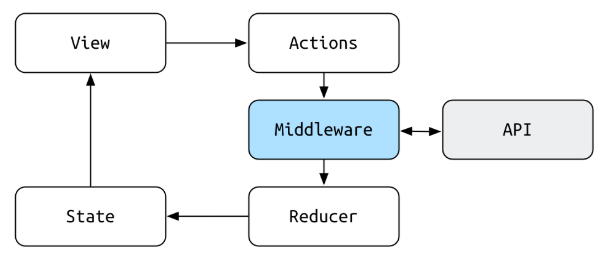

- Applikasjonstilstandshåndtering
- En felles tilstand for hele applikasjonen
- Tilstanden styres av Actions som håndteres av Reducere som igjen populerer tilstanden.
  - En Action kan f.eks. være **"FETCH\_POSTNUMMER"**
  - Når en slik actions kjøres, så vil en Reducer ta imot og oppdatere tilstanden slik at det er i tilstanden at applikasjonen nå henter postnummer.
  - Når er hentingen er fullført, vil man f.eks. sende en action **"FETCH\_POSTNUMMER\_FULFILLED"** som har postnummer-data med som parameter.
  - Reducer håndterer denne handlingen og setter postnummer-data i applikasjonens tilstand.
- Vedlikeholdt av Facebook, under MIT lisens.

## Fordeler ved å bruke redux

- En felles state for alle komponenter
- Komponenter kan kobles direkte mot state og kan oppdatere denne uavhengig av andre komponenter
- Gir en stor frihet til valg av struktur på state.
- Enkelt å eksportere til json og importere fra json (hvis strukturen er lik)

## Links

- https://redux.js.org
- https://github.com/reactjs/redux