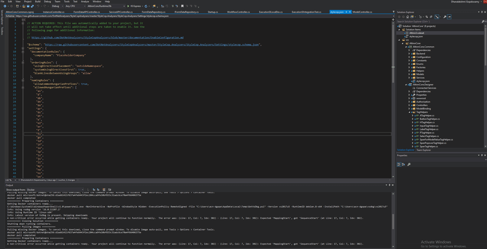

StyleCop.Analyzers provides warnings that indicate style and consistency rule violations in C# code.
The warnings are organized into rule areas such as documentation, layout, naming, ordering, readability, spacing, and so forth.
Each warning signifies a violation of a style or consistency rule.

In Altinn Studio, we have turned set this "warning" action to "Error" to enforce the use of rules.

## Nuget Package
Instructions to install the stylecop analyzer in your project can be found [here](https://github.com/DotNetAnalyzers/StyleCopAnalyzers).

## Ruleset

A solution wide stylecop ruleset and configuration(stylecop.json) is set for altinn studio application.
This can be linked to the projects by linking these files like below in the project.
It is set to only work when building in Debug mode.

```xml {hl_lines=[9]}
<ItemGroup Condition="'$(Configuration)'=='Debug'">
  <PackageReference Include="StyleCop.Analyzers.Unstable" Version="1.1.1.61" />    
  <AdditionalFiles Include="$(SolutionDir)stylecop.json">
    <Link>stylecop.json</Link>
  </AdditionalFiles>
</ItemGroup>

<PropertyGroup Condition="'$(Configuration)'=='Debug'">
  <CodeAnalysisRuleSet>$(SolutionDir)Altinn3.ruleset</CodeAnalysisRuleSet>
</PropertyGroup>
```

We have turn on the rules that will improve the code quality and maintainability.

## Turn off/Turn on a rule

To turn on/off a rule from the ruleset,

1. Click on Altinn3.ruleset file in the solution explorer
2. Expand the Stylecop.Analyzers
3. Check/uncheck the rule you want to turn on/off
4. If you are turning on a rule, select the action to be "Error"



## Implemented rules in Altinn Studio

The list of rules that are implemented (and not implemented) in altinn studio can be found
[here](https://github.com/Altinn/altinn-studio/blob/master/Altinn3.ruleset).


## Links

- [Rule Documentation](https://github.com/DotNetAnalyzers/StyleCopAnalyzers/blob/master/DOCUMENTATION.md)
- [Configuring Stylecop Analyzer](https://github.com/DotNetAnalyzers/StyleCopAnalyzers/blob/master/documentation/Configuration.md)
- [Github](https://github.com/DotNetAnalyzers/StyleCopAnalyzers)

