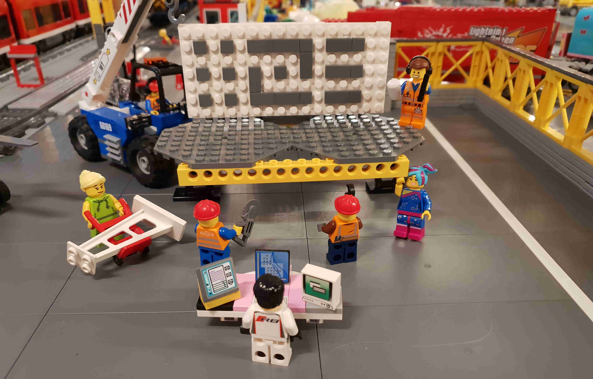

{}
**Develop digital applications using our tools and APIs**  
Looking for technical guidance on how to build your own apps with our products?
See [the Altinn Studio user guide](https://altinn.github.io/docs/altinn-studio/). (Partially in Norwegian.)
{}

Altinn Studio is the next generation Altinn application development solution.
All you need for testing the preview is to [register an account](/getting-started/first-time-setup).

Altinn Studio have an open backlog on GitHub and the code is open source. Everybody can [create bugs], [request features] or [ask questions].

  
  

    <a href="https://github.com/Altinn/altinn-studio/" class="a-linkFeatured ">
      Contributing to Altinn Studio
      <i class="ai ai-sm ai-nw ai-nw-right ai-arrowright"></i>
    </a>
    
We love your input! We want to make contributing to this project as easy as possible. 

  
  

    <a href="/teknologi/altinnstudio/architecture/" class="a-linkFeatured">
      Architecture
      <i class="ai ai-sm ai-nw ai-nw-right ai-arrowright"></i>
    </a>
    
Description of the Altinn Studio architecture, build process, infrastructure and security.

  

  
  

    <a href="/teknologi/altinnstudio/development/handbook/" class="a-linkFeatured">
      Development handbook
      <i class="ai ai-sm ai-nw ai-nw-right ai-arrowright"></i>
    </a>
    
The development handbook should provide the information needed to contribute to the development of Altinn Studio.

  

[Altinn Studio]: https://altinn.studio
[open backlog]: https://github.com/altinn/altinn-studio/issues/
[milestones]: https://github.com/altinn/altinn-studio/milestones?direction=asc&sort=due_date&state=open
[create bugs]: https://github.com/Altinn/altinn-studio/issues/new?template=bug_report.md
[request features]: https://github.com/Altinn/altinn-studio/issues/new?template=feature_request.md
[ask questions]: https://github.com/Altinn/altinn-studio/issues/new?template=question.md
[GitHub]: https://github.com/altinn/altinn-studio
[the code]: https://github.com/altinn/altinn-studio
