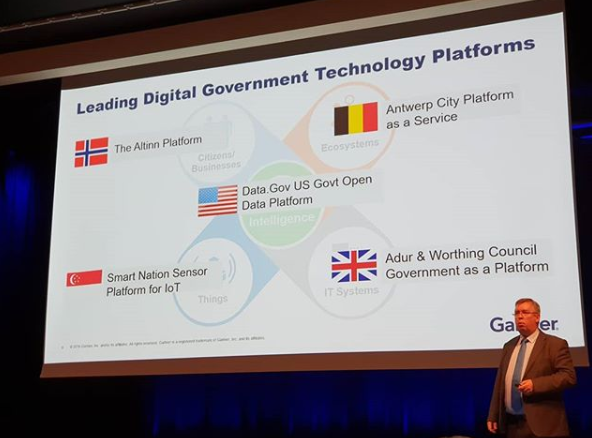

The platform is is owned by the Norwegian Digitalization Agency and developed as an open source platform.

The current development solution and hosting platform (launched 2010) is considered by Gartner
as one of the five leading digital government technology platforms in the world.

The current platform is used by over 90% of the Norwegian population and almost 100% 
of the businesses. Over 55 agencies and municipalities host their solutions in the Altinn platform.

## What is Altinn Studio?

Altinn Studio is the third-generation application development solution from Altinn. 
Norway's public platform for E-Government.  

Altinn Studio gives organizations an efficient and self-serviced way to design, build and deploy containerized applications in a modern cloud infrastructure.
These applications can have GUI for web access and/or APIs for system integrations. An app can contain any type of functionality targeted for users and/or systems.

The current platform has almost 1000 active solutions supporting different user scenarios.  
Examples of solutions in the current platform is: Tax reporting, aircraft incident reporting, correspondence services from health department, lookup service in to the business register and many many more.

## What is Altinn Apps?

Altinn Apps is the infrastructure where apps developed in Altinn Studio is running. 
This is a highly scalable platform for running container-applications with a seperate Kubernetes cluster for each organizations, giving maximum isolation and flexibility.

## What is Altinn Platform?

Altinn Platform is a highly scalable platform with reusable micro services used by apps and other systems.
Altinn Platform have services for storage of data, authorization, authentication, userprofile+++.

## What types of apps can be built with Altinn Studio and hosted in Altinn Apps?

The first version will support apps where the use case is to submit data from the end 
user or system to the organizations.

## Why Altinn Studio?

There are many reasons to use Altinn Studio instead of building everything from scratch.

- Easy to develop and deploy apps
- Reuse of data, APIs and functionality (code)
- A known platform for end users
- Highly scalable and secure infrastructure
- Open source

## When was it launched?

The first version was launched in June 2020 and the first applications was deployed to production on june 19. 2020.

## Presentations

Below you find a presentation done at NDC Conferences Oslo June 11. 2020!

The presentation starts at 4:58:43. 



[Presentation June 11. 2020 NDC Conference](https://github.com/Altinn/altinn-studio-docs/raw/master/content/teknologi/altinnstudio/files/altinn_3_ndc_2020_06_11.pptx)
