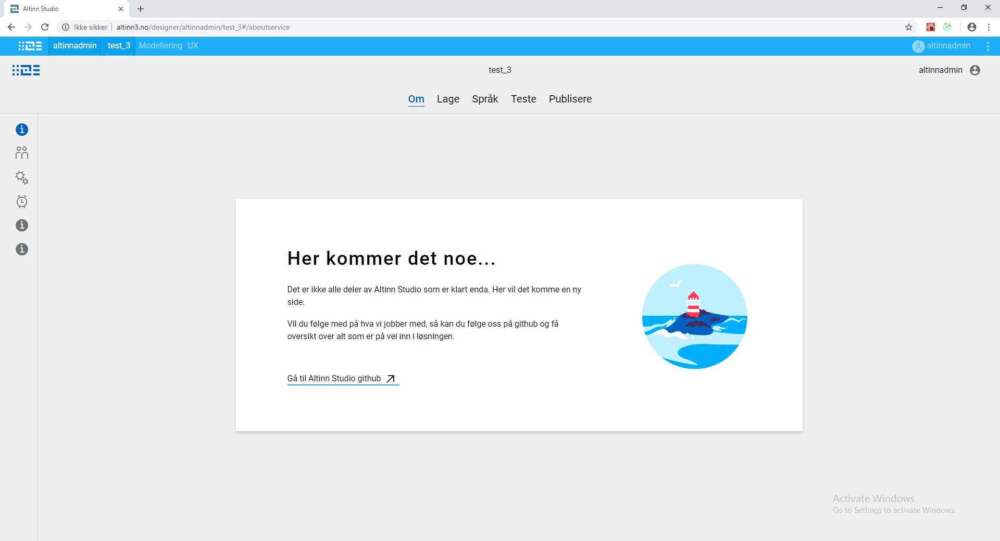

## Work in progress page

There are many areas in altinn.studio where the functionality is not implemented yet (but will be available in upcoming releases).

There is a need to inform the user about this and provide a good user experience.
So a work in progress page is displayed on all areas where the implementation has either not started or in progress.

