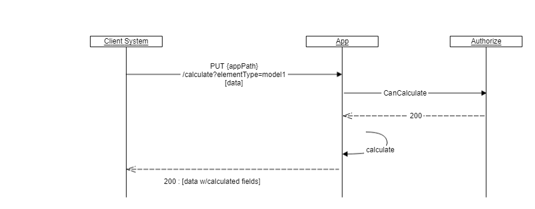
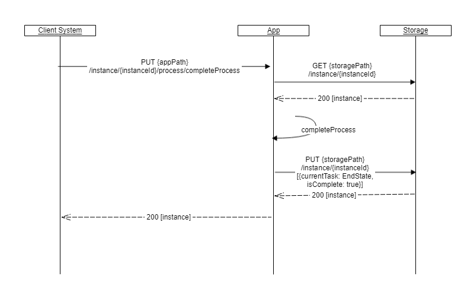

{}
This is work-in-progress. This is a proposed API which most likely is going to change. 

{}

## Introduction

There are primarily two types of consumers of the Altinn APIs. 
The first group consists of applications and systems used by the owners of the applications hosted on the Altinn platform. The group is called *Application Owners*.
The second group consists of organisations and people using the applications through a client system, the group is called *Application Users*. 
The two groups have many similar needs, but there are also differences in what type of tasks they need to be able to perform. 
Traditionally the two groups have had access to completely separated API endpoints in Altinn. 
The new API will be available to both parties, but with some functions that will normally be used only by one of the groups. 

### Application Owner

A list of common tasks for an application owner.

- Query instances for a given application according to status
- Create an application instance
- Upload form data
- Download form data
- Confirm successful download
- Change process state (workflow)

### Application Users

A list of common tasks for an end user.

- Create an application instance
- Upload form data
- Download form data
- Change process state (workflow)
- View status of an instance

## Two different APIs

The new solution will have multiple APIs. There are two APIs available for Application Owners and Users.
There will be one API for each application cluster, called the *Application API*, and one for the Platform Storage cluster, called *Platform Storage API*. 
Both apis will provide similar operations. The Application API has business rules and must be used for validation of schema data, to change process state of the application instance. 
The Platform Storage API will provide access to information stored by the application. [More information on the Platform apis can be found here](/architecture/application/altinn-platform)

### Application API

An api that provides access to all instances of a specific app.

```http
appPath = https://org.apps.altinn.no/org/app
```

Identifies the organisation cluster and the application. Should be used to instantiate an application, to validate data, to change process and to save/update data elements.

### Platform Storage API

An api that provides access to all instances of all apps, it should be used to access metadata about instances and to download data elements.

```http
storagePath = https://platform.altinn.no/storage
```

Should be used by application owners to download data elements. Downloads will be logged. 

## Create an application instance

Altinn assigns an unique identifier to all users that wishes to report data. We call this id *instanceOwner.partyId*. 
If you do not know this, you should provide the official identity number, e.g national identification number for persons or organisation number for organisations, and in some case user name. This should be provided as part of the payload to the creation request. Altinn will look up this identifier and replace it with the instanceOwner.PartyId. The official identity number will be stored in the instance metadata.

Data elements can be provided as part of the creation request, but can also be uploaded at a later time.

The client specify the instance owner and can set a number of the metadata fields of the instance by attaching the following form:

```json
{
    "appId" : "org/app",
    "instanceOwner": {
        "personNumber": "12247918309",
        "organisationNumber": null
    },
    "appOwner": {
        "labels" : [ "gr", "x2" ]
    },
    "dueBefore": "2019-06-01T12:00:00Z",
    "title": { "nb": "Arbeidsmelding for Ola Nordmann" },
    "visibleAfter": "2019-05-20T00:00:00Z",
    "status": {}
}
```

Notice that all dates must be expressed in **Utc (Zulu)** time zone and represented according to ISO 8601!

Data elements (files) can be attached to the initial request as a *multipart/form-data* or as *attachments*. The name of the parts must correspond to element types defined in the application metadata. 

```http
POST {appPath}/instances
```


A multipart formdata should contain the instance json document and the data element files of the instance. The first part should be *instance* which contains the json template to create an instance from. The subsequent parts must have a name that correspond to the element types defined in application metadata. They may have a filename. Hence the *model1* and *certificate* names correspond to data types defined in the application metadata. If more data elements are needed they must be defined in the application metadata.

```http
Content-Type: multipart/form-data; boundary="abcdefg"

--abcdefg
Content-Type: application/json; charset=utf-8
Content-Disposition: form-data; name="instance"
{ ... }

--abcdefg
Content-Type: application/xml
Content-Disposition: form-data; name="model1"
<xml> ... </xml>

--abcdefg
Content-Type: application/pdf
Content-Disposition: form-data; name="certificate"; filename=certificate.pdf
%PDF-1.4
%Óëéá
1 0 obj
...

--abcdefg--
```

This call will return the instance metadata record that was created. A unique identifier, which consist of the instance owner id and an guid, will be generated and should be used for later reference.

```json
{
    "id": "347829/762011d1-d341-4c0a-8641-d8a104e83d30",
    "selfLinks": {
        "apps": "{appPath}/instances/347829/41e57962-dfb7-4502-a4dd-8da28b0885fc",
        "platform": "{platformPath}/instances/347829/41e57962-dfb7-4502-a4dd-8da28b0885fc"
    },
    "appId": "org/app",
    "instanceOwner": {
        "partyId": "347829",
        "personNumber": "12247918309"
    },
    "created": "2019-03-06T13:46:48.6882148Z",
    "createdBy": "org23",
    "dueBefore": "2019-06-01T12:00:00Z",
    "visibleAfter": "2019-05-20T00:00:00Z",
    "title": { "nb": "Arbeidsmelding for Ola Nordmann"},
    "process": {
        "started": "2019-09-25T09:32:44.20Z",
        "currentTask": {
            "started": "2019-10-10T32:22.00Z",
            "elementId": "Task_1",
            "name": "Fyll ut",
            "altinnTaskType": "data",
            "validated": {
                "timestamp": "2019-10-04T12:00.00Z",
                "canCompleteTask": true
            }
        }
    },
    "status": {
        "archived": null,
        "softDeleted": null,
        "hardDeleted": null
    },
    "appOwner": {
         "labels": [ "gr", "x2" ],
    },
    "data": [
    {
        "id": "692ee7df-82a9-4bba-b2f2-c8c4dac69aff",
        "dataType": "model1",
        "contentType": "application/xml",
        "blobStoragePath": "org/app/762011d1-d341-4c0a-8641-d8a104e83d30/data/692ee7df-82a9-4bba-b2f2-c8c4dac69aff",
        "selfLinks": {
            "apps":   "{appPath}/instances/347829/762011d1-d341-4c0a-8641-d8a104e83d30/data/692ee7df-82a9-4bba-b2f2-c8c4dac69aff",
            "platform": "{storagePath}/instances/347829/762011d1-d341-4c0a-8641-d8a104e83d30/data/692ee7df-82a9-4bba-b2f2-c8c4dac69aff"
        },
        "filename": "prefill.xml",
        "created": "2019-03-06T15:00:23Z",
        "createdBy": "org23",
        "size": 20001,
        "locked": false,
    },
    ...
    ]
}
```

### Create a data element

Post a data file (e.g. an xml-document) as body of request with matching headers. Must specify dataType as defined in the application metadata.

```http
POST {appPath}/instances/347829/41e57962-dfb7-4502-a4dd-8da28b0885fc/data?dataType=default
```

This call updates the instance metadata and returns the data element that were created.

```json
{
    "id": "692ee7df-82a9-4bba-b2f2-c8c4dac69aff",
    "dataType": "default",
    "contentType": "application/xml",
    "blobStoragePath": "org/app/762011d1-d341-4c0a-8641-d8a104e83d30/data/692ee7df-82a9-4bba-b2f2-c8c4dac69aff",
    "selfLinks": {
        "apps":   "{appPath}/instances/347829/762011d1-d341-4c0a-8641-d8a104e83d30/data/692ee7df-82a9-4bba-b2f2-c8c4dac69aff",
        "platform": "{storagePath}/instances/347829/762011d1-d341-4c0a-8641-d8a104e83d30/data/692ee7df-82a9-4bba-b2f2-c8c4dac69aff"
    },
    "filename": "default.xml",
    "created": "2019-03-06T15:00:23Z",
    "createdBy": "org23",
    "lastChanged": "2019-03-07T15:00:23Z",
    "lastChangedBy": "org23",
    "size": 20001,
    "locked": false
}
```

### Update a data element

Update (replace) a data element with a new one (payload). Data as multipart or as single body. Client does a PUT request to the App. It first calculates the data and replaces the existing data element. It returns the instance metadata to the client.


```http
Content-Type = "image/png"
Content-Disposition = attachment; filename=myfile.png

PUT {appPath}/instances/347829/762011d1-d341-4c0a-8641-d8a104e83d30/data/692ee7df-82a9-4bba-b2f2-c8c4dac69aff
```

### Get a specific data element

Clients can download the data element by a get request. Notice that application owner's get of an instance owners data will update metadata for on data element.

```http
GET {storagePath}/instances/347829/762011d1-d341-4c0a-8641-d8a104e83d30/data/692ee7df-82a9-4bba-b2f2-c8c4dac69aff
```

```json
{
...
"data": [
    {
        "id": "692ee7df-82a9-4bba-b2f2-c8c4dac69aff",
        "dataType": "default",
        "filename": "default.xml",
        "contentType": "application/xml",
        "lastChange": "2019-03-06T15:00:23Z",
        "lastChangedBy": "org24",
        "size": 34059,
        "locked": false,
        "applicationOwner": {
            "downloaded": ["2019-05-15T08:23:01Z"]
        }
    }
]
}
```

## Receipt data element

All applications has an element type called `ref-data-as-pdf`. This is the place to store generated pdf receipt data.

### Upload a pdf and associate the pdf with an existing data element

```http
POST {storagePath}/instances/347829/762011d1-d341-4c0a-8641-d8a104e83d30/data?dataType=ref-data-as-pdf&refs=692ee7df-82a9-4bba-b2f2-c8c4dac69aff
```

Results in a new data element with reference to the first. It is also possible to reference multiple data elements.

```json
{
...
"data": [
    {
        "id": "692ee7df-82a9-4bba-b2f2-c8c4dac69aff",
        "dataType": "model1",
        "filename": "default.xml",
        "contentType": "application/xml",
        "lastChanged": "2019-03-06T15:00:23Z",
        "lastChangedBy": "org24",
        "size": 34059,
        "locked": true,
        "applicationOwner": {
            "downloaded": ["2019-05-15T08:23:01Z"]
        }
    },
    {
        "id": "c15f0401-e19d-4f1d-8ad1-1ce8cc96eb5d",
        "dataType": "ref-data-as-pdf",
        "filename": "model1-view.pdf",
        "contentType": "application/pdf",
        "lastChanged": "2019-10-10T15:00:23Z",
        "lastChangedBy": "org24",
        "size": 34059,
        "locked": false,
        "refs": ["692ee7df-82a9-4bba-b2f2-c8c4dac69aff"]
    }
]
}
```

### Download the PDF of a data element

Select the data PDF you want to download from the list of the instances' list of data elements.

Get list

```http
GET {storagePath}/instances/347829/762011d1-d341-4c0a-8641-d8a104e83d30/data
```

Get one data element

```http
GET {storagePath}/instances/347829/762011d1-d341-4c0a-8641-d8a104e83d30/data/c15f0401-e19d-4f1d-8ad1-1ce8cc96eb5d
```

## Application owner download[^1]

[^1]: Not implemented yet!

### Downloads is logged on the data element

### Confirm successful download (as application owner)

Application owner must confirm that the data element file was downloaded sucessful.

```http
PUT {storagePath}/instances/347829/762011d1-d341-4c0a-8641-d8a104e83d30/data/692ee7df-82a9-4bba-b2f2-c8c4dac69aff/confirmDownload
```

```json
{
...
"data": [
    {
        "id": "692ee7df-82a9-4bba-b2f2-c8c4dac69aff",
        ...
        "applicationOwner": {
            "downloaded": ["2019-05-15T08:23:01Z"],
            "downloadConfirmed": ["2019-05-16T10:23:00Z"]
        }
    }
]
}
```

### Download a complete instance with data elements and corresponding pdfs

```http
GET {storagePath}/instances/347829/762011d1-d341-4c0a-8641-d8a104e83d30/downloadAll
```

Will return a multipart http response with the following content:

1. instance metadata (application/json)
2. the first data element (application/xml)
3. second data element (e.g. attachement)
4. third data element (e.g. image)
5. fourth data element (e.g. pdf)
6. ...

## Query instances

Application owners can search for application instances with a simple GET request towards the *instances* endpoint.

For example: To get all instances of appId *org/app*, that is in at task with id *Task_2* (which is Submit, see process definition), has last changed date greater than *2019-05-01* and that has label *gruppe3*.

```http
GET {storagePath}/instances?appId=org/app&process.currentTask=Task_2&lastChanged=gt:2019-05-01&appOwner.label=gruppe3
```

Another example is get all instances of all apps of an organisation *org* that has ended date greater than 2020-03-10.

```http
GET {storagePath}/instances?org=org&process.ended=gt:2020-03-10
```

On query parameters specifying date time you can use the following operators:

* gt: - greater than
* gte: - greater than or equal to
* lt: - less than
* lte: - less than or equal to
* eq: - equal (can also be blank)

They can be combined to define a range:

```http
dueBefore=gt:2019-02&dueBefore=lt:2019-03-01
```

The query returns a result object (page) which includes a collection of instance that matched the query. 100 instances is returned by default. Use *size* to get more or less instances per page. To get to the next page you have to use the *continuationToken* present in the *next* link.

The instances endpoint returns a query result object with information about how many total hits *totalHits* that the query matched and how many objects returned *count*. 

The endpoint supports plain *application/json*.

```json
Accept: application/json
{
    "totalHits": 234,
    "count": 50,
    "self": "{storagePath}/instances?appId=org/app&size=50",
    "next": "{storagePath}/instances?appId=org/app&size=50&continuationToken=%257b%2522token%2522%253a%2522%252bRID%..."
    "instances": [
            {...},
            {...},
            ...
      ]
    }
}
```

## Events

### Instance events

All instance events, e.g. creation, read, save, change process state, ...

```http
GET {storagePath}/instances/347829/762011d1-d341-4c0a-8641-d8a104e83d30/events
```

Example of event data.

```json
{
    "id":"6dff32bc-0928-4ae8-937c-b362d6941c89",
    "instanceId": "60238/5c6b1a71-2e1f-447a-ae2f-d1807dcffbfb",
    "eventType": "deleted",
    "created": "2019-05-02T13:08:21.981476Z",
    "instanceOwnerPartyId": "60238",
    "user": {
        "userId": 338829,
        "authenticationLevel": 1,
        "enduserSystemId": 2
    },
    "process": {
        "started": "2019-05-01T12:45:01.3233Z",
        "startEvent": "Start_22",
        "currentTask": {
            "elementId": "Task_2"
        }
    }
}
```

### Application events (for application owners)[^1]

> **WARNING**: This section will be redesigned

Selected instance events. Created, first read, change process state. Optinally specified by application developer.

Events can be queried. May be piped.

```http
GET {storagePath}/applications/org/app/events?created=gte:2019-03-30&process.currentTask=Task_2
```

## Validation

There are multiple endpoints that can trigger validation and provide feedback regarding the state of an instance and its data. Some of them validates data already uploaded and stored in Altinn while others can validate input.

### Validate stored instance

This action will validate an entire instance including the all data elements already uploaded and stored in Altinn. Validation will be performed based on current task in the process. Validation will ensure that all required data elements, as defined by the application metadata, have been uploaded and are valid. If the result of the validation is that nothing is missing or wrong, the action will update the instance with information indicating that the instance is valid. The response will be an empty array. In the case of validation issues the response will provide an array of the identified issues. Validation of a full instance use validation of data as described in the chapter below.

```http
GET https://{org}.apps.at21.altinn.cloud/{org}/{app}/instances/{instanceOwnerPartyId}/{instanceId}/validate
```

Example response:
```json
[
    {
        "severity": "Error",
        "scope": "INSTANCE",
        "targetId": null,
        "field": null,
        "code": "TooManyDataElementsOfType",
        "description": "TooManyDataElementsOfType"
    }
]
```

### Validate stored data

This action will validate a specific data element already uploaded and stored in Altinn. The logic validates that the data element has the correct Content-Type, that it isn't too large and so on. Data elements with a model bound to them will be validated against the model (Schema). Validation will also check that the data element being validated is required for the current task in the process. If the data is validated during a task different from what is intended, the validator will give a warning.

```http
GET https://{org}.apps.at21.altinn.cloud/{org}/{app}/instances/{instanceOwnerPartyId}/{instanceId}/data/{dataid}/validate
```

Example response:
```json
[
    {
        "severity": "Error",
        "scope": "default",
        "targetId": null,
        "field": null,
        "code": "MissingContentType",
        "description": "MissingContentType"
    }
]
```

### Validate data[^1]

The application will provide a method to validate the datamodel without creating a instance of the data. Data must be provided as formdata. The validate method takes a data file of an dataType and performs validation on that file. It returns a validation report.


```http
PUT {appPath}/validate?dataType=modelA
```

## Calculate / check business rules[^1]

The app will provide a method to perform calculation / perform business rules for a datamodell to an app.
The calculate method takes a data file and performs calculations and returns the possibly altered data file with updated fields.



```http
PUT {appPath}/calculate?dataType=modelB
```

## Instantiation details

### Instantiate an app

Client instantiates an app. The app create an initial data element (file) according to the app's prefill rules. Instance metadata, with links to the data element is returned which allow the Client to download the data.
Process is set to first task. The task specifies if the data can be updated or not.


### Instantiate an app and complete process

Instantiate an app with data as multipart content (stream). The app creates an instance and stores the attached data element. The app attempts to complete the process. If the process is completed successfully, the data can no longer be updated.


## Process

Application has a process definition that specifies start events, end events, tasks and the allowed flows (transitions) between these. A process is started by the application, which selects a start event to start and follows the sequence flow to the first task and creates a current task object to holde the process state.


A process is represented by an process modell in BPMN/XML notation. Each task has an unique id, which is used to refer to the task in the api.

```xml
 <bpmn2:process id="Process_1" isExecutable="false">
    <bpmn2:startEvent id="StartEvent_1">
      <bpmn2:outgoing>SequenceFlow_1</bpmn2:outgoing>
    </bpmn2:startEvent>
    <bpmn2:task id="Task_1" name="Fyll ut" altinn:tasktype="data">
      <bpmn2:incoming>SequenceFlow_1</bpmn2:incoming>
      <bpmn2:outgoing>SequenceFlow_2</bpmn2:outgoing>
    </bpmn2:task>
    <bpmn2:task id="Task_2" name="Send inn" altinn:tasktype="submit">
      <bpmn2:incoming>SequenceFlow_2</bpmn2:incoming>
      <bpmn2:outgoing>SequenceFlow_3</bpmn2:outgoing>
    </bpmn2:task>
    <bpmn2:endEvent id="EndEvent_1">
      <bpmn2:incoming>SequenceFlow_3</bpmn2:incoming>
    </bpmn2:endEvent>
    <bpmn2:sequenceFlow id="SequenceFlow_1" sourceRef="StartEvent_1" targetRef="data_1" />
    <bpmn2:sequenceFlow id="SequenceFlow_2" sourceRef="Task_1" targetRef="Task_2" />
    <bpmn2:sequenceFlow id="SequenceFlow_3" sourceRef="Task_2" targetRef="EndEvent_1" />
  </bpmn2:process>
```

### Altinn specific task types

Application developers can in their BPMN Definition specify some altinn specific task types, see ```altinn:tasktype```, which signify the behaviour of the task. So far we have defined the following:

- *data* - user is asked to fill inn one or more data elements, e.g. upload data or fill in forms
- *submit* - user is asked if he should submit the information which has been filled in on previous tasks
- *payment* - user is asked to pay a specific amount
- *signing* - user is asked to provide a digital signature
- *external* - task is handled by an external entity, user must wait until they have completed the task.

### Get process state of a specific instance

```http
GET {appPath}/instances/347829/41e57962-dfb7-4502-a4dd-8da28b0885fc/process
```

For an ongoing process this process state can look like the json below. It indicates that the process was started at a given date time and that it's current task is *Task_1*. The flow number indicates the sequence of process events/tasks that occurs during the execution of the process. Notice that same task can be visited multiple times in a process if there is a sequence flow that allows that.

```json
{
        "started": "2019-09-25T09:32:44.20Z",
        "currentTask": {
            "flow": 2,
            "started": "2019-10-10T32:22.00Z",
            "elementId": "Task_1",
            "name": "Fyll ut",
            "altinnTaskType": "data",
            "validated": {
                "timestamp": "2019-10-04T12:00.00Z",
                "canCompleteTask": true
            }
        }
    },
```

For an ended process the following will be returned:

```json
{
    "started": "2019-09-25T09:32:44.20Z",
    "startEvent": "StartEvent_1",
    "ended": "2019-10-10T14:01:22.034Z",
    "endEvent": "EndEvent_1"
}
```

### Process events

The system will generate a number of process related events, which can be found in the instances event history.

- Start Event
- StartTask Event
- EndTask Event
- End Event

#### Start Event

```json
{
    "instanceId": "347829/41e57962-dfb7-4502-a4dd-8da28b0885fc",
    "eventType": "process:Start",
    "processInfo": {
        "started": "2019-09-25T09:32:44.20Z",
        "startEvent": "StartEvent_1"
    },
    "createdDateTime": "2019-10-10T14:01:22.034Z",
}
```

#### StartTask Event

```json
{
    "instanceId": "347829/41e57962-dfb7-4502-a4dd-8da28b0885fc",
    "eventType": "process:StartTask",
    "processInfo": {
        "started": "2019-09-25T09:32:44.20Z",
        "startEvent": "StartEvent_1",
        "currentTask": {
            "flow": 2,
            "started": "2019-10-01T13:22.01Z",
            "elementId": "Task_1",
            "name": "Fyll ut MVA rapport",
            "altinnTaskId": "data"
        }
    },
    "createdDateTime": "2019-10-01T13:22.01Z",
}
```

#### EndTask Event

```json
{
    "instanceId": "347829/41e57962-dfb7-4502-a4dd-8da28b0885fc",
    "eventType": "process:EndTask",
    "processInfo": {
        "started": "2017-10-01T13:22.00Z",
        "startEvent": "StartEvent_1",
        "currentTask": {
            "flow": 2,
            "started": "2019-10-05T01:11.33Z",
            "elementId": "Task_1",
            "altinnTaskId": "data",
            "ended": "2019-10-05T01:11.33Z"
        }
    },
    "createdDateTime": "2019-10-05T01:11.33Z",
}
```

#### End Event

```json
{
    "instanceId": "347829/41e57962-dfb7-4502-a4dd-8da28b0885fc",
    "eventType": "process:EndEvent",
    "processInfo": {
        "started": "2017-10-01T13:22.00Z",
        "startEvent": "StartEvent_1",
        "ended": "2019-10-05T08:15:23.544Z",
        "endEvent": "EndEvent_1"
    },
    "createdDateTime": "2019-10-05T08:15:23.544Z",
}
```

#### Get process history of a specific instance[^1]

Based on the process events the history of the instance's process is generated. The following illustrates an ended process:

```http
GET {appPath}/instances/347829/41e57962-dfb7-4502-a4dd-8da28b0885fc/process/history
```

```json
[{
    "flow": 1,
    "type": "process:startEvent",
    "elementId": "StartEvent_1",
    "occured": "2019-10-10T14:01:22.034Z",
},
{
    "flow": 2,
    "type": "process:task",
    "elementId": "Task_1",
    "started": "2019-10-01T13:22.01Z",
    "ended": "2019-10-05T01:11.33Z",
},
{
    "flow": 3,
    "type": "process:task",
    "elementId": "Task_2",
    "started": "2019-10-05T08:14:33.232Z",
    "ended": "2019-10-05T08:15:23.543Z"
},
{
    "flow": 4,
    "type": "process:endEvent",
    "elementId": "EndEvent_1",
    "occured": "2019-10-05T08:15:23.544Z"
}]
```

### Start Process

To start a process one can post start to the process endpoint.

```http
POST {appPath}/instances/347829/41e57962-dfb7-4502-a4dd-8da28b0885fc/process/start[?startEvent=StartEvent_1]
```

This will start the process and move the process state to the first task from the given start. If process has more than one start event, then the client has to chose which one to start with the startEvent query parameter.

### Complete and move to next task

The process logic attempts to finish the current task and then moves the process forward to the next task in the flow. The cannot always select the next task, especially when more than one tasks can be chosen. In this case the client must chose which process element id to select.


```http
PUT {appPath}/instances/347829/41e57962-dfb7-4502-a4dd-8da28b0885fc/process/next[?id=Task_2]
```

### Complete the process

The complete process method will attempt to complete the process for an instance. Hence, the app will move the process from one task to the next until it reaches an valid end state.

If a task's exit condition is not met, the process will be stopped in the last valid task. And the user must manually fix the problem and complete the process.



```http
PUT {appPath}/instances/347829/41e57962-dfb7-4502-a4dd-8da28b0885fc/process/completeProcess
```


### Get the next tasks in a process

Returns an list of the next tasks/events that can be reached from the current task.

```http
GET {appPath}/instances/347829/41e57962-dfb7-4502-a4dd-8da28b0885fc/process/next
```

### Start a task

If you are at a specific task and want to start the next task you can try to put next to the process endpoint. The process controller then tries to close the current task and start the wanted task. Updates process state accordingly. If exit condition of current task is not met, an error will be returned. If the task is not directly reachable by the flow, an error will be returned.

```http
PUT {appPath}/instances/347829/41e57962-dfb7-4502-a4dd-8da28b0885fc/process/next?id=Task_2
```

## Application resources

The application has a number of resource files that is used by the app's frontend and which defines it's behaviour.

### Application metadata

Get application's metadata :

```http
GET {appPath}
```

```json
{
    "id": "test/sailor",
    "versionId": "v32.23-xyp",
    "org": "test",
    "app": "sailor",
    "created": "2019-03-06T13:46:48.6882148Z",
    "createdBy": "XXX",
    "title": { "nb": "Testapplikasjon", "en": "Test Application" },
    "processId": "twoTasksDataAndSubmit",
    "validFrom": "2019-04-01T12:14:22Z",
    "validTo": null,
    "maxSize": -1,
    "dataTypes": [
        {
            "id": "model1",
            "appLogic": {
                "autoCreate": true,
                "classRef": "Skjema22",
                "schemaRef": "schemas/boatdata"
            },
            "description": {"nb": "Båtdata", "en": "Boat data"},
            "allowedContentTypes": ["application/json"],
            "taskId": "Task_1",
            "maxSize": 200000,
            "minCount": 1,
            "maxCount": 1,
        },
        {
            "id": "crewlist",
            "appLogic": {
                "autoCreate": false,
                "classRef": "CrewList",
                "schemaRef": "schemas/crewlist"
            },
            "allowedContentTypes": ["application/xml"],
            "taskId": "Data_2",
            "maxSize": -1,
            "minCount": 1,
            "maxCount": 3,
        },
        {
            "id": "certificate",
            "appLogic": null,
            "allowedContentTypes": ["application/pdf"],
            "task": "Task_1",
            "maxSize": -1,
            "minCount": 1,
            "maxCount": 1,
        },
        {
            "id": "receipt",
            "appLogic": null,
            "allowedContentTypes": ["application/pdf"],
            "maxSize": -1,
            "minCount": 0,
            "maxCount": -1,
        }
    ]
}
```

### Process model[^1]

Get the application's process model.

```http
GET {appPath}/process
```

Returns the bpmn file defining the process.

### Get text resources for the application for a specific language[^1]

```http
GET {appPath}/texts?lang=nb
```
<!-- OLD http://altinn3.no/runtime/api/Language/GetLanguageAsJSON?languageCode=nb -->

### Get text resources for a given element type[^1]

```http
GET {appPath}/metadata/{typeName}/texts?lang=nb
```
<!-- OLD http://altinn3.no/runtime/api/textresources/RtlOrg/apitracing -->

### Get the schema for a given element type[^1]

```http
Accept=application/schema+json
GET {appPath}/metadata/{typeName}/schema
```

### Get the model config for a given element type[^1]

```http
GET {appPath}/metadata/{typeName}/modelConfig
```
(ServiceMetadata.json)
<!-- OLD http://altinn3.no/runtime/api/metadata/RtlOrg/apitracing/ServiceMetaData -->

### Get the layout for a given element type[^1]

```http
GET {appPath}/metadata/{typeName}/layout
```
(FormLayout.json)
<!-- OLD http://altinn3.no/runtime/api/resource/RtlOrg/apitracing/FormLayout.json-->

### Gets the rules for a given element type[^1]

```http
GET {appPath}/metadata/{typeName}/rules
```

(RuleHandler.js)
<!-- OLD http://altinn3.no/runtime/api/resource/RtlOrg/apitracing/RuleHandler.js -->

### Get the API service configuration for how the app calls external APIs[^1]

```http
GET {appPath}/metadata/{typeName}/externalApis
```
(ServiceConfiguration.json)
<!-- OLD (Service configuration) http://altinn3.no/runtime/api/resource/RtlOrg/apitracing/ServiceConfigurations.json -->


{}
