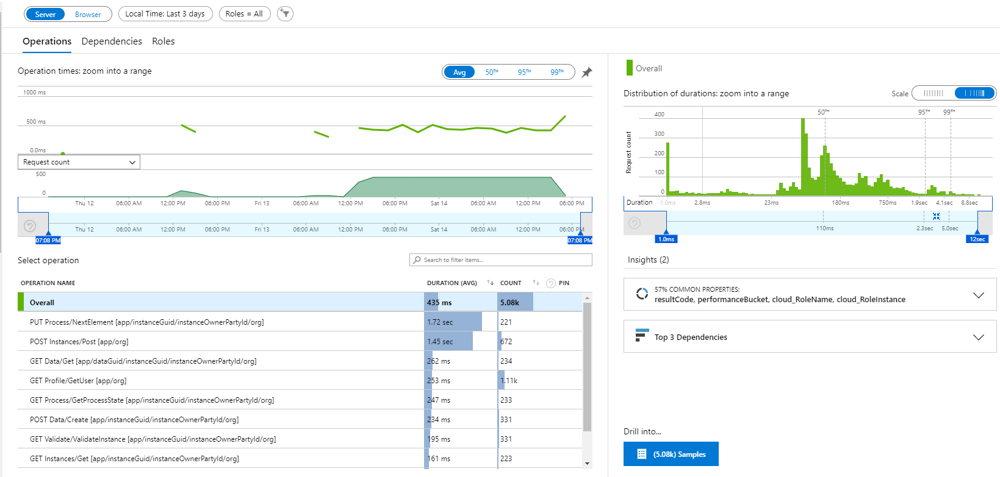
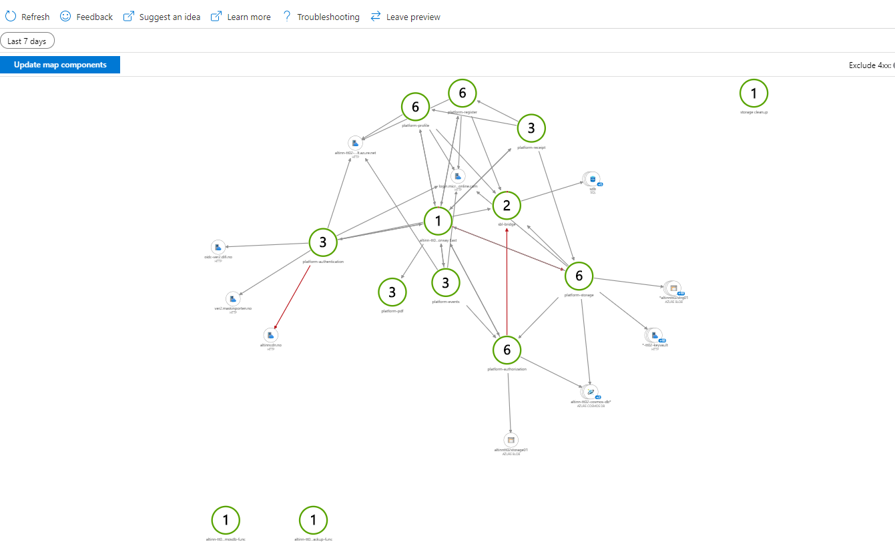
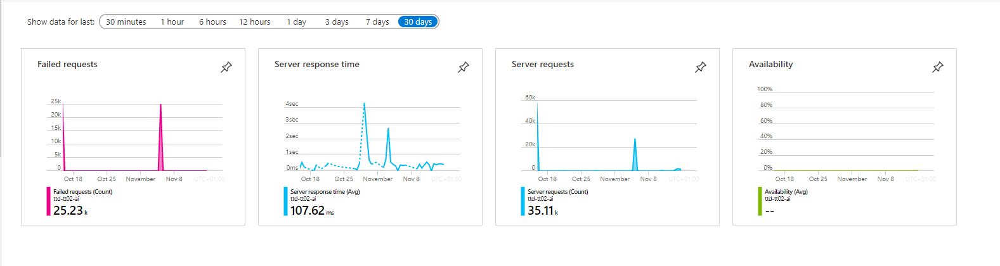
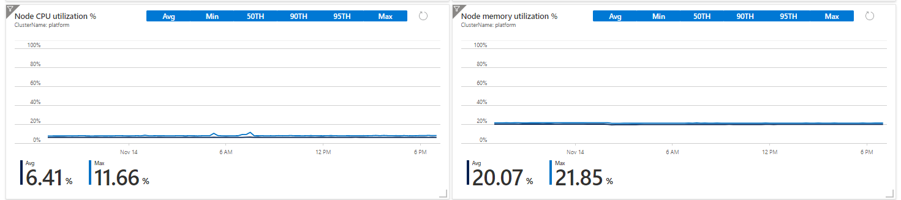

Altinn 3 uses serveral features of [Azure Monitor](https://docs.microsoft.com/en-us/azure/azure-monitor/overview).  

### Monitoring

[Application Insights](https://docs.microsoft.com/en-us/azure/azure-monitor/app/app-insights-overview) 
is used to monitor different aspects of the platform.

The above screenshot shows statistics for different requests.  

This screenshots shows how Application Insights presents how traffic flows between the different applications in the solutions.

This screenshots show how a request flows through the different applications

This screenshots show how a request flows through the different applications

This screenshots show how a request flows through the different applications

### Alerts

[Azure Alerts](https://docs.microsoft.com/en-us/azure/azure-monitor/platform/alerts-overview) is used to define rules to notify the DevOps team about issues
in the platform.    

Alerts are posted to a specific Alerts channel on Slack. 