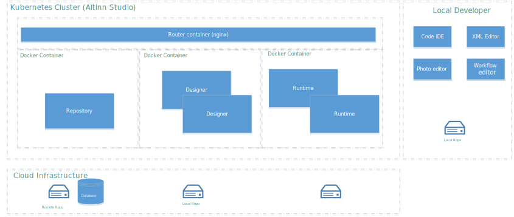

{}
**NOTE: Outdated stuff alert!** Needs to be updated. Runtime is no longer deployed as part of Studio.
{}

The diagram below show the different applications that is part this.

## Repository
Gitea is used as Repository in Altinn Studio App Development solution. There is one 
instance of Gitea running in a docker container in the solution.
It uses cloud service database and cloud file share for configuration and remote repos.

The Repository is accessed both from the designer application and from code IDE's from
app developers computers. 

## Designer
Designer is the web based editor for anything related to the app development (UI, workflow, rules, ++).
It runs as a Linux container.

## Routing
NGINX is used for routing between the different applications.

## Local Developer
App Developers can use locally installed IDE and other tools and communicate directly 
with the repository. This is targeted for the more experienced developers.

## Local Developer with Altinn Studio
For developers that is required to develop custom widgets (React) they can install 
Altinn Studio locally on their computer. (Altinn Studio support both Windows, Linux and macOS)

