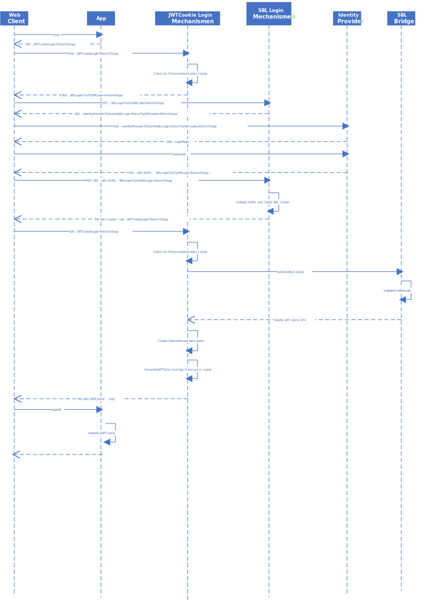
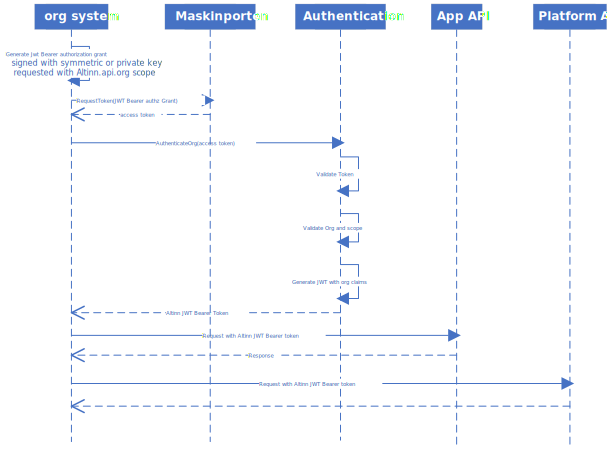

As part of the authentication component there will be some API's that support authentication of different types of users and systems. 

## API for SBL Authentication cookie
This API creates a JWT Cookie (A cookie with a JWT Token) based on the SBL Cookie created during login in the Legacy SBL solution.
This API uses API in the SBL Bridge to verify the cookie and get information about the logged in user.

Based on this information this API creates a JWT token with claims about the user (userid, authentication level ++) and sign the JWT token with the private key of Altinn Platform.

The login process for a user that wants to access a app in Altinn Apps is described below.

[Download as Visio](loginprocess.vsdx).

## Exchange API for tokens

Altinn supports tokens from different ID-providers, and in the future it is expected that the list of supported ID-providers will grow.

To reduce complexity and increase performance the clients needs to exchange the external tokens to a Altinn token.

In this way the different apps does not need to know about all ID-providers, and is not required to look up org identificator or Altinn userId/partyId that is 
added to the Altinn token.

## Exchanging ODIC token from ID-porten

Altinn supports end users logging in with OIDC in their end user system. (local instalation or cloud based).

The end user system gets a ID-token and a access-token from ID-porten. 

The access token is exchanged in the API to an Altinn JWT token containing the needed attributes like userId

## Exchanging token from MaskinPorten

To authenticate a system like this Altinn Platform requires that the system is registred as a client in Maskinporten for a given org.
The org need also to be given scopes that matches the scopes for the API requested in Maskinporten. 

This will be given by Altinn. 

The org system should be given the scope needed by the administrator of org. (done through Maskinporten API described under 4 [here](https://difi.github.io/idporten-oidc-dokumentasjon/oidc_guide_maskinporten.html#4-konfigurere-oauth2-klient))

The org system would need to request a access token from Maskinporten with the correct scope.
This token will be used in the org API in Authentication component in the Altinn Platform
to create a new JWT token that can be used for all org apis in Apps and platform.

During the verification process of the Maskinporten JWT token the scope and org is verified.

During this process the Maskinporten token is exchanged to a Altinn token containing information about the authenticated org.
This increases performance since org information does not need to be looked up for each request and the different apps and platform components would not need to know about all the different ID-providers supported by Altinn.

The below sequence diagram show how this will happen:

[Download as Visio](loginprocess_org.vsdx).
