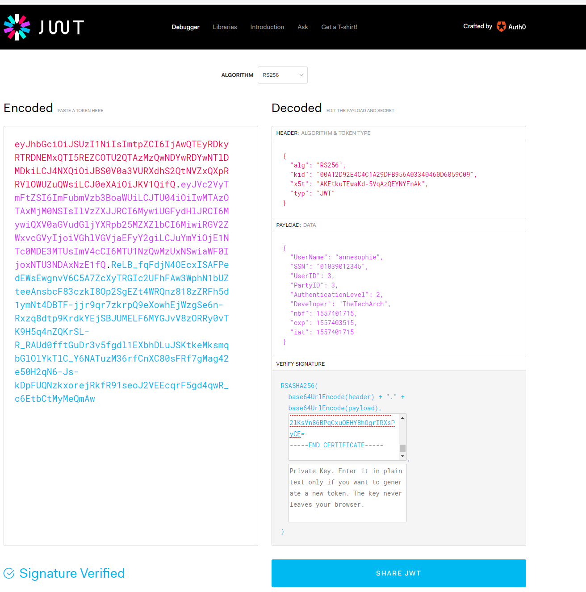

[JSON Web Token](https://jwt.io/) are an open, industry standard [RFC 7519](https://tools.ietf.org/html/rfc7519) method for representing claims securely between two parties and are choosen
as the bearer of information about users and systems.

The format that is choosen for JWT tokens is RSA256. This is a asymetric algorithm where the Authentication component in Altinn Platform
generates tokens based on a private key in a certificate, and everyone can validate the token with the public key.

Altinn Platform and Altinn Apps support JWT tokens as bearer tokens in Authorization header and as JWT Tokens inside cookie. 

The cookie will be  used when users access application with a frontend in Altinn Apps (typical React application). 
The bearer token will be used when the user access throug mobile apps or external systems. 

The below screenshot shows how a JWT Token can be verified at jwt.io

## Claims in token

| Claim                | Description                                            |
| -------------------- | ------------------------------------------------------ |
| UserId               | The internal Altinn userId for the authenticated user. |
| ssn                  | The social security number.                            |
| PartyId              |                                                        |
| AuthenticationLevel  | The authentication level used when user logged in.     |
| AuthenticationMethod | The authentication method used when user logged in.    |
| end user system Id   | The internal ID for end user system.                   |
| SystemOwnerPartyId   | The internal PartyID for system owner.                 |
