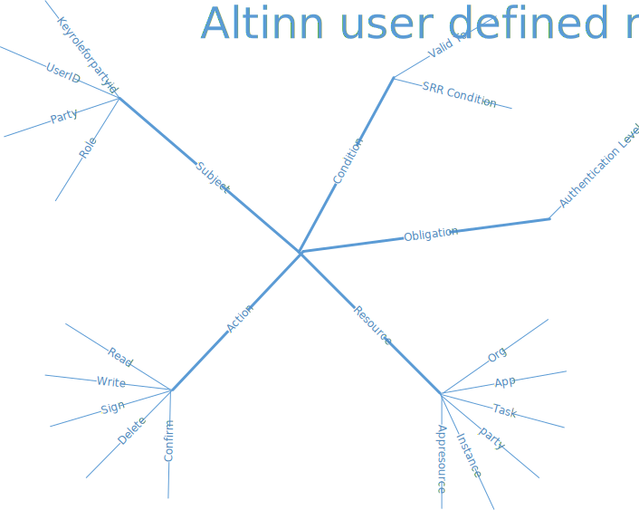

The authorization capabilties is based around ABAC (Attribute Based Access Controls) and the XACML standard. 

The following concepts are important

## Rights
In Altinn Apps/Platform a right is a permission to perform an action on a given resource. 
The action can be one of some predefined option like read, write and sign but can also be any other action defined on a 
custom api in the apps.
The resource is typical an app instance or part of it where data belongs to a given party (person or organisation).

A user or system gets a right based on rules that describes permissions based on being a specific user or having a specific role.

## Rules
A authorization rule in Altinn Platform defines who has been given the right to perform actions on a given resource.
A rule consist of 5 elements

### Resource
This describe which resource the rule applies for. Altinn Apps currently support the following resource types in rules.

- Org - Unique identifier of the organisation responsible for the app.
- App - Application identifier which is unique within an organisation.
- Task - A specific task in the process defined for a app

Some of the resourcetypes is meant to be used in combination. As an exemple you can have been given the right for an app for a given reportee

### Subject
The subject in a authorization rule identifies who the rules applies for. In Altinn Apps/Platform the resource can be the following.

- RoleType
- org

### Action
The Action part of the rule define what type of action that the subject can perform on the resource.
In Altinn Studio we have the following actions

- Read
- Write
- Sign
- ArchiveRead
- ArchiveDelete

### Condition
The condition part of the rule is extra conditions needed to be fulfilled for the rule to be valid. In Altinn Studio
we have the following types of conditions.

- Valid To

### Obligation
A obligation is a obligation that needs to be followed it the user is permited or denied.
In Altinn Apps/Platform this is used to define the minimun authentication level.

## Creation of rules
The rules in Altinn Studio Apps is defined when the app developer defines the rules for the app. 
The rules are deployed together with the App to a given Altinn Studio App environment.

In Altinn II end user can also create rules. This happens when:
- When user creates a local role that contains rights that user have through other roles
- When delegating single rights to a user or organisation.

The rules is slightly different since rules defined by the end user have different subjects and can be defined for a 
more limited resource.

#### Altinn Studio rule

#### User defined rule 

## Roles
Altinn Studio Apps will retrieve roles from Altinn II Administration. This will later could be expanded to other sources for roles. 

## Scopes
API Scopes are used in the solutions in some uses cases where organizations are authenticated through the external ID-Provider "MaskinPorten"

The organization need to have been delegated scopes in MaskinPorten to do some specific operations.

Scopes is always used together with the authorization rules.

### Scopes

- altinn:instances.read : Give system the right to access API for reading instances
- altinn:instances.write : Give system the right to access API for writing to instances

## Solution components

The application solutions components are described [here](/teknologi/altinnstudio/architecture/components/application/solution/altinn-platform/authorization/)