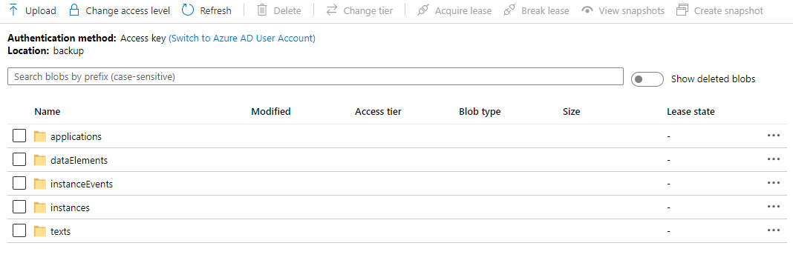
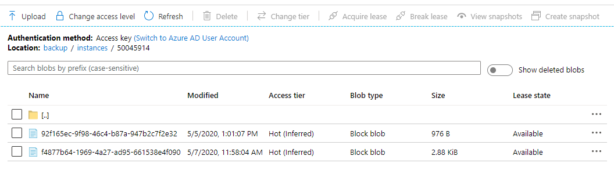
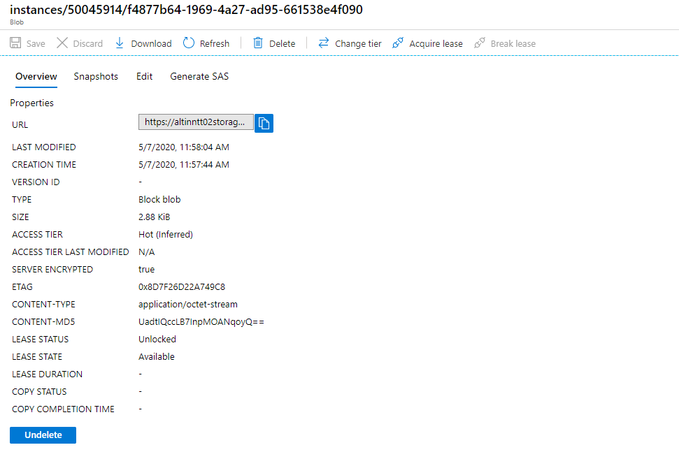
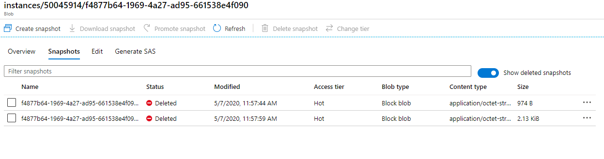

As described below, the [backup and recovery capabilities](/teknologi/altinnstudio/architecture/capabilities/devops/platformoperations/backupandrecovery/)
there are serveral scenarious where the different type of data is lost.

This page describes the application components that makes it possible to protect against data loss.

## Backup

### Altinn Platform

As described in the data section of the architecture documentation Altinn Platform stores data both in
Azure Cosmos DB and in Azure Blob Storage.

There is different solutions for the different data stores.

#### Cosmos DB

##### Built in backup functionality

Azure Cosmos DB [automatically takes backups](https://docs.microsoft.com/en-us/azure/cosmos-db/online-backup-and-restore)
of your data at regular intervals. The automatic backups are taken without affecting the performance
or availability of the database operations. All the backups are stored separately in a storage service, and those backups
are globally replicated for resiliency against regional disasters.

Azure Cosmos DB automatically takes a backup of your database every 4 hours and at any point of time, only the
latest 2 backups are stored. However, if the container or database is deleted, Azure Cosmos DB retains the existing
snapshots of a given container or database for 30 days.

This functionality is out of the box when using Azure Cosmos DB.

This backup would only be relevant to use if all data is lost from Cosmos DB.

##### Custom backup with help of Azure Function

To support recovery of single or group of documents we needed to create a custom backup mechanismen.

For this we use the change feed that Azure Cosmos DB expose.

Change feed support in Azure Cosmos DB works by listening to an Azure Cosmos container for any changes. It then
outputs the sorted list of documents that were changed in the order in which they were modified. The changes are
persisted, can be processed asynchronously and incrementally, and the output can be distributed across one or
more consumers for parallel processing.

 

The solution is to have a [Azure Function that listens to the change feed](https://docs.microsoft.com/en-us/azure/cosmos-db/change-feed-functions)  
and copies documents from Cosmos DB when they are created or modified to a blob storage. 

The blob storage is a shared blob storage for all orgs.  (The same way Cosmos DB is shared)
The blob storage have enabled [soft delete](https://docs.microsoft.com/en-us/azure/storage/blobs/storage-blob-soft-delete?tabs=azure-portal).
All versions of a document in Cosmos should be written to the same blob. Soft delete will keep track of all versions.

The following collections has a Azure Function that takes backup. Click on name for code details about Azure Function

- [Applications](https://github.com/Altinn/altinn-studio/blob/master/src/Altinn.Platform/Altinn.Platform.Storage/CosmosBackup/Applications/Applications.cs)
- [DataElements](https://github.com/Altinn/altinn-studio/blob/master/src/Altinn.Platform/Altinn.Platform.Storage/CosmosBackup/DataElements/DataElements.cs)
- [InstanceEvents](https://github.com/Altinn/altinn-studio/blob/master/src/Altinn.Platform/Altinn.Platform.Storage/CosmosBackup/InstanceEvents/InstanceEvents.cs)
- [Instance](https://github.com/Altinn/altinn-studio/tree/master/src/Altinn.Platform/Altinn.Platform.Storage/CosmosBackup/Instances)
- [Texts](https://github.com/Altinn/altinn-studio/blob/master/src/Altinn.Platform/Altinn.Platform.Storage/CosmosBackup/Texts/Texts.cs)

The below images show how the documents are backed up in a blob storage and soft delete has created a snapshot that last for 90 days. 
In theese 90 days we are able to recover the document to an earlier version.

#### Blob storage

Each org has their own separte storage account with a blob storage to store data for applications.
In addition Altinn Platform has a shared blobstorge where metedata like XACML is stored for the different Apps.

To protect against unwanted deletion or changes we have enabled soft delete.

When enabled, soft delete enables you to save and recover your data when blobs or blob snapshots are deleted.
This protection extends to blob data that is erased as the result of an overwrite.

When data is deleted, it transitions to a soft deleted state instead of being permanently erased.
When soft delete is on and you overwrite data, a soft deleted snapshot is generated to save the state of the overwritten data.

For Altinn we have 90 days retention period. Inside that periode we can recover a blob to an earlier version.

[See more about soft delete on Azure Documentation](https://docs.microsoft.com/en-us/azure/storage/blobs/storage-blob-soft-delete?tabs=azure-portal).

## Recovery

[Altinn ReStorage](../.../../../../../../../../../teknologi/altinnstudio/solutions/altinn-restorage/) is a command-line interface application that enables operators to
retrieve version history and metadata about elements as well as restore and undelete them.

Currently it supports restoring data elements. Further functionality is defined in [this epic](https://github.com/Altinn/altinn-studio/issues/4152) on GitHub.

