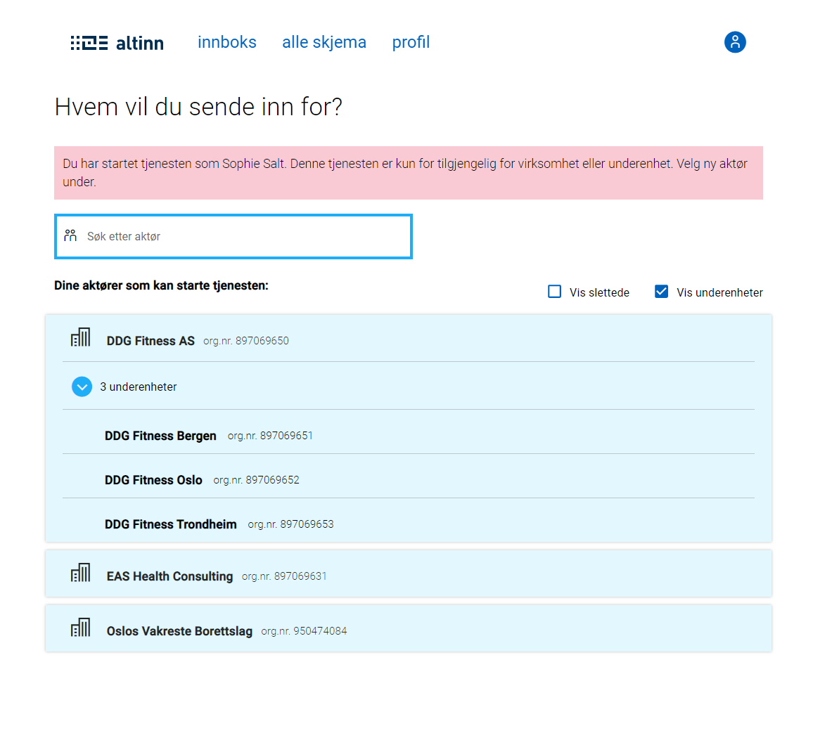
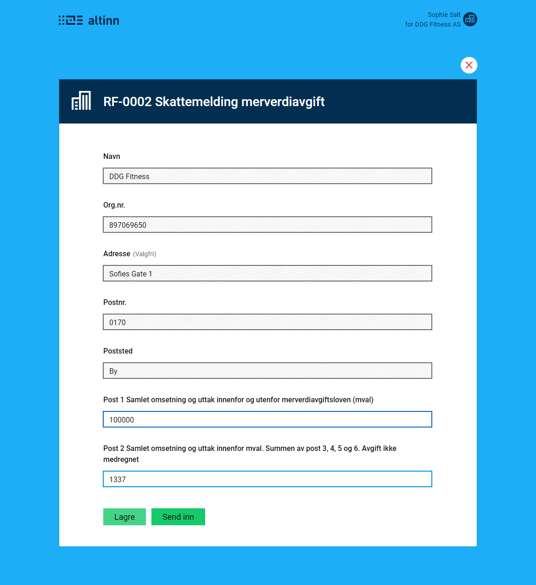
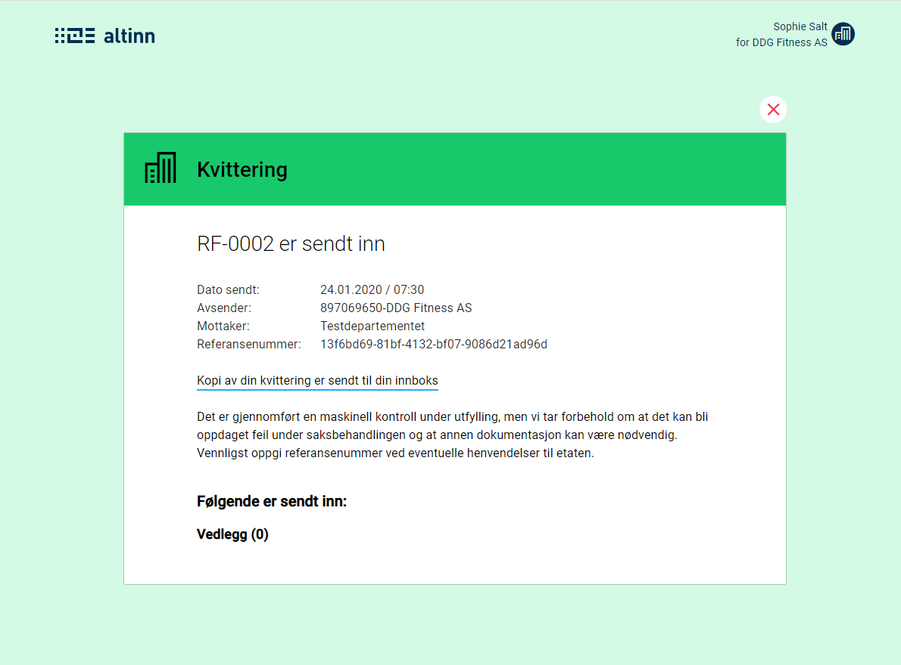

Functionality in Altinn Apps are located in the Apps deployed to the Altinn Apps functionality.

This functionality depends on what kind of application template the app is based on and what the app developer have added in addition. 

{}
<object data="/teknologi/altinnstudio/architecture/components/application/solution/altinn-apps/altinnapps__solutionarchitecture.svg" type="image/svg+xml" style="width: 100%;"></object>
{}

## Instanstation

The app has instansiation functionality that presents the user for a list over alternative parties that he can select to instansiate a app for.

The app developer can add instansiation controll that veriy the type of party selected.

He can also add instansiation validation logic that can check anything.

## Formfilling

Formfilling renders the UI designed in Altinn Studio and lets the user input data

## Process handling

The app handles a defined process hand moves the app ahead in process depending on the task defined in the process. Currently it is limited to only data tasks

## Receipt

When process is completed the user is shown a receipt.

## Validation

Application developers can add validaiton logic to the app. User of the app will then gets it data validated and get error messages if the data is not valid.

## Calculation
Application developers cann add calculation logic to the app. Users of the app will then get calculated data based on data inputed or prefilled

## Prefill
Application developers can configure register and profile prefill.
This means that the app will take values from register and profile and set them to the defined field in the datamodel.

The user will then experience that known fields of data about him or the choosen party is already filled out in the datamodel for the app.

Application developers can also add custom logic that retrieve prefill data from other api's outside Altinn. 
This logic is run when app is instansiated.
