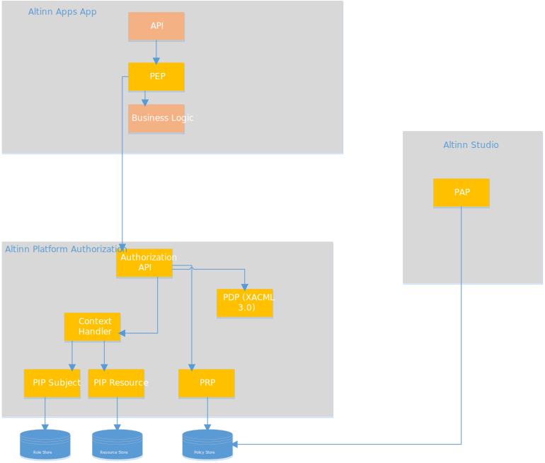

The authorization components are based on [attribute based access control (ABAC)](https://en.wikipedia.org/wiki/Attribute-based_access_control).

In short, a request is authorized based on attributes for the request. Eg what data element is the user accessing, who owns it,
what type of data element, and so on.

The authorization architecture for the Altinn Platform is based on the [XACML reference architecture](https://en.wikipedia.org/wiki/XACML).

The following diagram describes the different solution components that provide Authorization capabilities.



This architecture defines the following components.

## PDP - Policy Decision Point

Responsible to decide if a request is authorized or not. [Read more](pdp)

## PAP - Policy Administration Point

Responsible for defining and administration authorization policies. [Read more](pap)

## PRP - Policy Retrieval Point

Responsible for identifying the correct policy for a request. [Read more](prp)

## Context Handler

Responsible for enriching the decision request so it can correctly be evaluated. [Read more](contexthandler)

## PIP - Policy information point

Responsible for providing information about the subject and the resource to the context handler. [Read more](pip)

## PEP - Policy Enforcement Point

Responsible for enforcing the decision from PDP. This is the component that blocks a request or let it through.

For details about how the components are constructed go [here](/teknologi/altinnstudio/architecture/components/application/construction/altinn-platform/authorization/).

## The Overall Authorization flow

The sequence diagram below shows how a request is authorized


## Example process

The following example flow describes in detail the authorization process when the REACT frontend calls an API to store form data

1. User trigger save in the REACT application. REACT application makes an HTTP post request against the 
[ServiceAPIController](https://github.com/Altinn/altinn-studio/blob/master/src/AltinnCore/Runtime/Controllers/ServiceAPIController.css) in 
2. The configured Policy Enforcement Point for the API, the [Service Access Handler](https://github.com/Altinn/altinn-studio/blob/master/src/AltinnCore/Runtime/Authorization/ServiceAccessHandler.cs),  
triggers to verify that user is authorized
3. The PEP identifies the authenticated user from authorizationhandler context and find the relevant resource ID from request
4. The PEP calls the PDP functionality in [Authorization Component](../) in Altinn Platform
5. PDP calls context handler to enrich the decision request
6. Context handler calls Storage PIP to get resource information
7. Context handler calls authorization PIP to get roles user have for resource party
8. Context handler enriches the decision request and returns to PDP
9. PDP calls PRP to get the policy for the resource
10. PDP evaluates the decision request and returns a decision response
11. If the result was Permit, the PEP validates the obligation from PDP to see if the authentication level was high enough.
If it is enough the request is let through
12. If the authentication level is not high enough the PEP will throw a not authorized exception (403)
13. If the result was "Not Applicable" the PEP will throw  a not authorized exception (403)

## Authorization API

The Authorization component exposes a REST-API to Altinn Apps.
Use the authorization API to manage authorizations in altinn platform.

### Parties

A party is a person whom  you can represent and perform a request on his behalf. A logged in user can retrieve a list of parties that he/she can represent.

#### Operations

Get a list of parties that the user can represent. The userid is sent as parameter.

```http
GET /authorization/api/v1/parties?userid={userid}
```

Validate that a given user is allowed to represent a given party. The partyid and userid are sent as parameters.

```http
GET /authorization/api/v1/parties/{partyId}/validate?userid={userid}
```

### Roles

A role in altinn offers or denies right to the logged in user to perform an action or group of actions for him or on behalf of someone.

#### Operations

Get a list of roles that the user can perform for the selected party.

```http
GET /authorization/api/v1/roles
```

### Policies

A set of polices contains authorization rules.

#### Operations

Stores / updates rules for a given app, defined in the query string.
The rules are sent in the body of the request. Reade more about the [policy format](prp).

```http
POST /authorization/api/v1/policies?org=org&app=app
```

{}