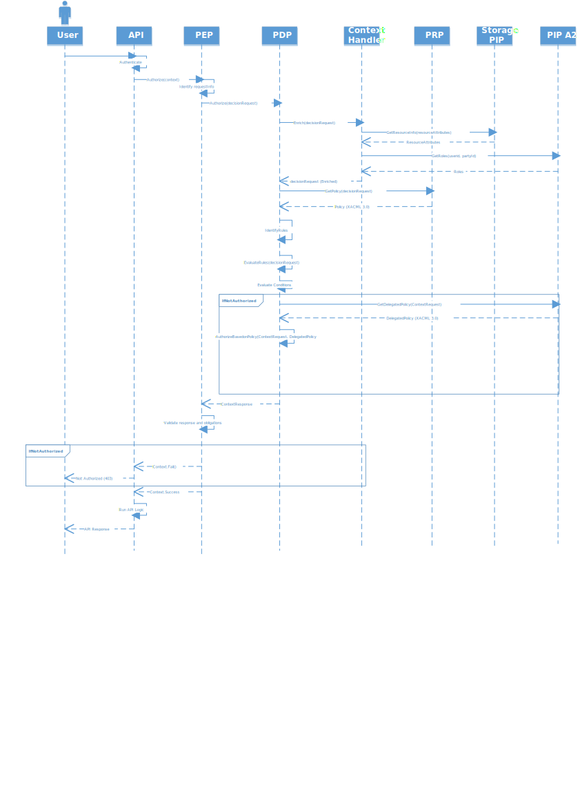

Altinn Platform has a [attribute based access control (ABAC)](https://en.wikipedia.org/wiki/Attribute-based_access_control).

In short, request is authorized based on attributes for the request. Eg what data element is the user accessing, who owns it, 
what type of data element and so on.

The Authorization Component contains a large part of the authorization architecture components.

## Authorization Architecture Components
The authorization architecture for Altinn Platform are based on the 
[XACML reference architecture](https://en.wikipedia.org/wiki/XACML).

This architecture defines the following components.

## The Overall Authorization flow
The sequence diagram below shows how request is authorized

## Example process

The following example flow describes in detail the authorization process when the REACT frontend calls an API to store form data

1. User trigger save in the REACT application. REACT application makes a http post request against the 
[ServiceAPIController](https://github.com/Altinn/altinn-studio/blob/master/src/AltinnCore/Runtime/Controllers/ServiceAPIController.css) in 
2. The configured Policy Enforcement Point for the API, the [Service Access Handler](https://github.com/Altinn/altinn-studio/blob/master/src/AltinnCore/Runtime/Authorization/ServiceAccessHandler.cs),  
triggers to verify that user is authorized
3. The PEP identifies the authenticated user from authorizationhandler context and find the relevant resource ID from request
4. The PEP calls the PDP functionality in [Authorization Component](../) in Altinn Platform
5. PDP calls context handler to enrich the decision request
6. Context handler calls Storage PIP to get resource information
7. Context handler calls authorization PIP to get roles user have for resource party
8. Context handler enriches the decision request and return to PDP
9. PDP calls PRP to get the policy for the resource
10. PDP evaluates the decision request and returns a decision response
11. If the result was Permit, the PEP validates the obligation from PDP to see if authentication level was high enough. 
If it is enough the request is let through
12. If the authentication level is not high enough the PEP will throw a not authorized exception (403)
13. If the result was "Not Applicable" the PEP will throw  a not authorized exception (403)