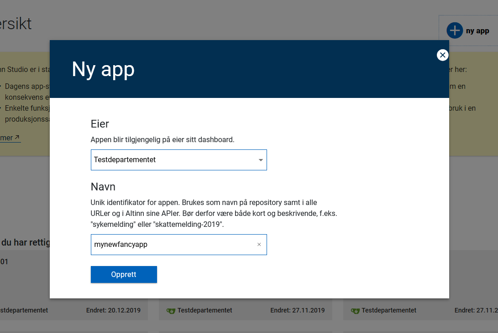

Altinn Studio Designer contains serveral functional components/modules.  

## Dashboard
Dashboard let the app developer search and find application developed in Altinn Studio. It possible to search across all orgs 

## App Creation
App creation functionaliy lets the app developer create applications. 

During this process the app developer can select the org that will own the app and the repository name for that app.

## App Info 
Application info module lets the user change the name of the app and add descriptions

## UI Editor
The UI-editor lets the app developer create a UI interface with WYSIWYG 

## Datamodel
The datamodel functionality lets the develope upload a XSD for datamodel creation in app.

When datamodel is uploaded a C# classes is generated based on this and metadata about datamodel is created.

## Build & Deploy
Build & Deploy functionality includes functionality to 
- Build created app to a docker container
- Upload docker container to a container registry
- Register the build in to a database
- Let the app developer select a previous build and deploy that container to a specific Altinn Apps environment (test, performance test, production ++)

## Process
Process functionality lets the app developer configure the given process that a user/system acessing the developed app should follow.

## Texts
The text module lets the app developer define the texts for a given app.

## Logic Editor
The logic editor module lets the app developer create and modify app logic like validation and calculation. This is a very simple browser based editor.
The recomendation is to clone the app repository and edit the code in a regular IDE like Visual Studio Code

## Policy Administration Point
As part of the application development process the developer defines the authorization policies for the app.

[Read more about pap and policies](pap)