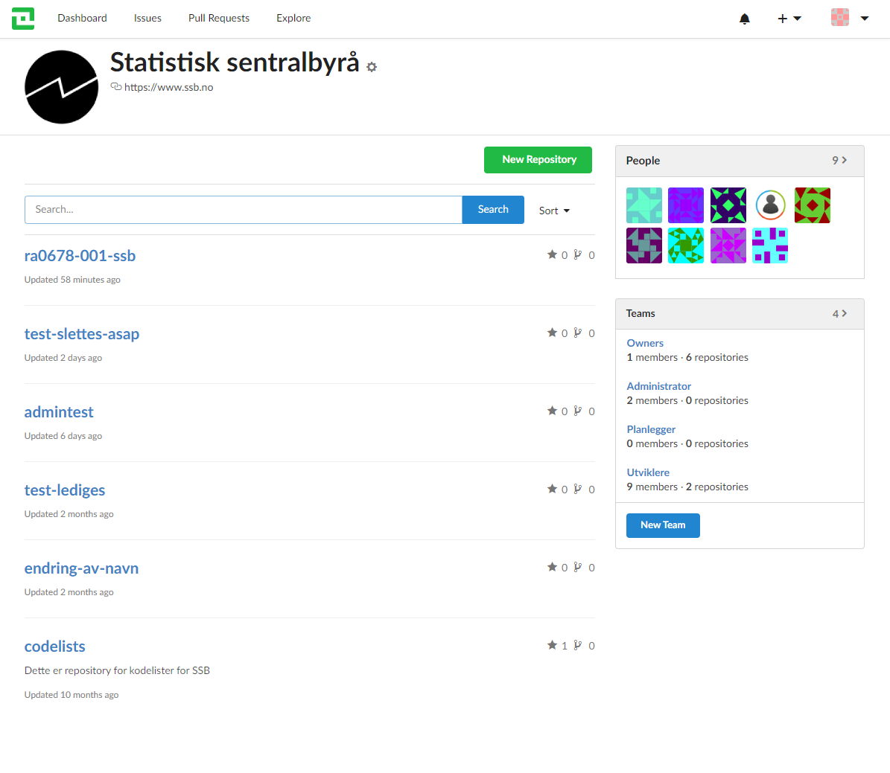
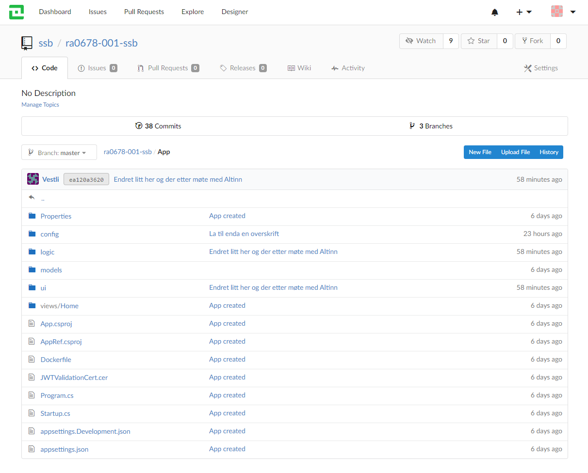
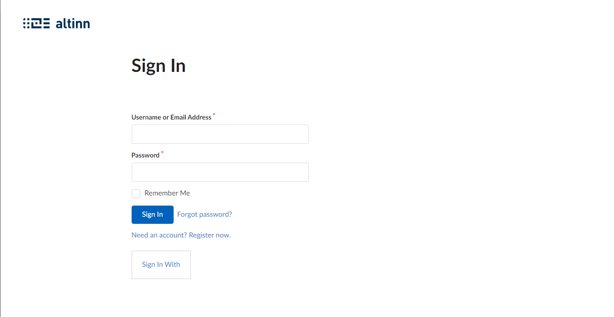
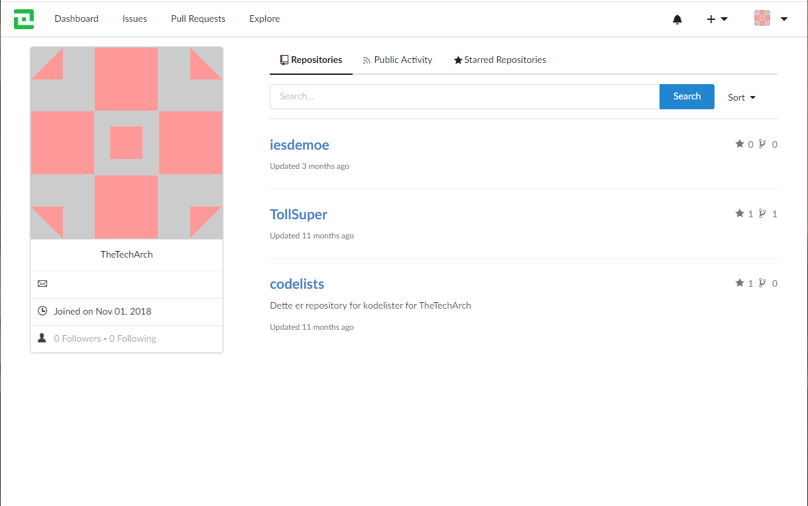

## Application Repositories

In Altinn Studio Repositories the developer find all repostiries for different organization and in every reporistory the source code for all apps are located.

## Git-based source control

The app developer can use the source control to clone, comitt, pull and other GIT related functionality. 

The app developer can view the application repository.

## Authentication

The login functionality for Altinn Studio is located in repositories

## User Profile

User profile in Altinn Studio Repostories lets the app developer manage its user profile.

