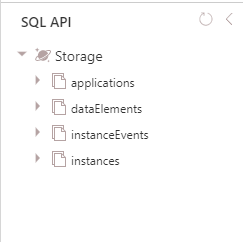

The following diagram shows the different entities stored. Click on the entity for the physical model used.


{}
<object data="/teknologi/altinnstudio/architecture/components/data/logical/logical_data_model.svg" type="image/svg+xml" style="width: 100%;"></object>
{}

[See fullscreen](/teknologi/altinnstudio/architecture/components/data/logical/logical_data_model.svg) / [Visio](/teknologi/altinnstudio/architecture/components/data/logical/logical_data_model.vsdx)

{}


Data is stored in Cosmos DB as JSON documents. In addition we use object database to store the raw objects of business data that org has defined for the application.





## Altinn Platform


### Instances

Example document from instance.

AppId is the reference to APP.

```json
{
    "id": "3cc58033-128e-414d-86c2-d652af251b39",
    "instanceOwner": {
        "partyId": "50002123",
        "personNumber": "01054210007"
    },
    "appId": "ttd/rip-livsgnist",
    "org": "ttd",
    "title": {
        "nb": "rip-livsgnist"
    },
    "process": {
        "started": "2020-01-16T10:54:04.7691165Z",
        "startEvent": "StartEvent_1",
        "ended": "2020-01-16T11:11:16.6358823Z",
        "endEvent": "EndEvent_1"
    },
    "status": {
        "archived": "2020-01-16T11:11:16.6358823Z"
    },
    "appOwner": {},
    "created": "2020-01-16T10:54:05.0591613Z",
    "createdBy": "20000015",
    "lastChanged": "2020-01-16T11:11:21.4678343Z",
    "lastChangedBy": "20000015",
    "_rid": "Mx4uAJesYy0BAAAAAAAAAA==",
    "_self": "dbs/Mx4uAA==/colls/Mx4uAJesYy0=/docs/Mx4uAJesYy0BAAAAAAAAAA==/",
    "_etag": "\"00004300-0000-3c00-0000-5e2044d90000\"",
    "_attachments": "attachments/",
    "_ts": 1579173081
}

```


### DataItem

Example document from data items

instanceGuid references to iinstance

blobstoragePAth references to the storage location for the given data


```json
{
    "instanceGuid": "7eae6eec-f686-40b6-bc57-6fafc8c94f13",
    "id": "94f277a5-7d37-48e1-973c-92fb1f84f83a",
    "dataType": "ServiceModel-test",
    "contentType": "application/xml",
    "blobStoragePath": "ttd/endring-av-navn-v2/7eae6eec-f686-40b6-bc57-6fafc8c94f13/data/94f277a5-7d37-48e1-973c-92fb1f84f83a",
    "size": 1515,
    "locked": false,
    "refs": [],
    "created": "2020-01-20T09:07:59.5480429Z",
    "lastChanged": "2020-01-20T09:08:48.3218863Z",
    "lastChangedBy": "20013900",
    "_rid": "Mx4uAOy+834VAAAAAAAAAA==",
    "_self": "dbs/Mx4uAA==/colls/Mx4uAOy+834=/docs/Mx4uAOy+834VAAAAAAAAAA==/",
    "_etag": "\"00004c00-0000-3c00-0000-5e256e210000\"",
    "_attachments": "attachments/",
    "_ts": 1579511329
}
```

### InstanceEvent

Example on instance event.

InstanceID references to the instance.


```json
{
    "user": {
        "userId": 20000015,
        "orgId": null,
        "authenticationLevel": 1,
        "endUserSystemId": null
    },
    "instanceId": "50002123/3cc58033-128e-414d-86c2-d652af251b39",
    "created": "2020-01-16T10:54:05.1706031Z",
    "eventType": "Created",
    "instanceOwnerPartyId": "50002123",
    "processInfo": {
        "started": "2020-01-16T10:54:04.7691165Z",
        "startEvent": "StartEvent_1",
        "currentTask": {
            "flow": 2,
            "started": "2020-01-16T10:54:04.7871455Z",
            "elementId": "Task_1",
            "name": "Utfylling",
            "altinnTaskType": "data"
        }
    },
    "id": "5c57d85b-18e4-4215-9976-065290ef086f",
    "_rid": "Mx4uAImMTtoBAAAAAAAAAA==",
    "_self": "dbs/Mx4uAA==/colls/Mx4uAImMTto=/docs/Mx4uAImMTtoBAAAAAAAAAA==/",
    "_etag": "\"0900c6e2-0000-3c00-0000-5e2040cd0000\"",
    "_attachments": "attachments/",
    "_ts": 1579172045
}

```


### Application

Example document on appliation


```json
{
    "id": "ttd-testavpdf-2020",
    "versionId": "7cfd1c857a8535c74690aa7d6c22258c94eabf6f",
    "org": "ttd",
    "title": {
        "nb": "testavpdf-2020"
    },
    "validFrom": "2020-01-14T11:39:00.3281424Z",
    "dataTypes": [
        {
            "id": "ServiceModel",
            "allowedContentTypes": [
                "application/xml"
            ],
            "appLogic": {
                "autoCreate": null,
                "classRef": null,
                "schemaRef": null
            },
            "taskId": "Task_1",
            "maxCount": 1,
            "minCount": 1
        },
        {
            "id": "ref-data-as-pdf",
            "allowedContentTypes": [
                "application/pdf"
            ],
            "maxCount": 0,
            "minCount": 0
        }
    ],
    "partyTypesAllowed": {
        "bankruptcyEstate": false,
        "organisation": false,
        "person": false,
        "subUnit": false
    },
    "created": "2020-01-14T11:39:00.3281424Z",
    "lastChanged": "2020-01-14T11:39:00.3281424Z",
    "_rid": "Mx4uAL3TuwQBAAAAAAAAAA==",
    "_self": "dbs/Mx4uAA==/colls/Mx4uAL3TuwQ=/docs/Mx4uAL3TuwQBAAAAAAAAAA==/",
    "_etag": "\"00008644-0000-3c00-0000-5e1da8540000\"",
    "_attachments": "attachments/",
    "_ts": 1579001940
}
```