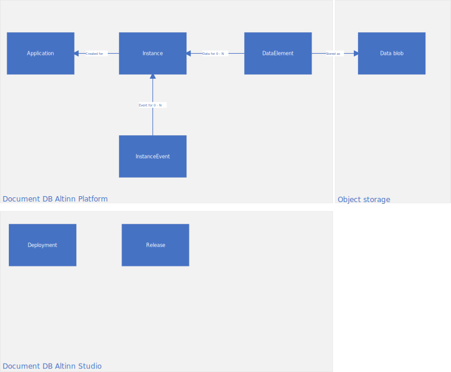

The following diagram shows the different entities stored. Click on the entity for the physical model used.



Data is stored in Cosmos DB as JSON documents.
In addition we use object database to store the raw objects of business data that org has defined for the application.


## Data Entities - Altinn Platform

### Instances

Example document from instance.

`appId` is the reference to the app.

```json {hl_lines=[7]}
{
    "id": "3cc58033-128e-414d-86c2-d652af251b39",
    "instanceOwner": {
        "partyId": "50002123",
        "personNumber": "01054210007"
    },
    "appId": "ttd/rip-livsgnist",
    "org": "ttd",
    "title": {
        "nb": "rip-livsgnist"
    },
    "process": {
        "started": "2020-01-16T10:54:04.7691165Z",
        "startEvent": "StartEvent_1",
        "ended": "2020-01-16T11:11:16.6358823Z",
        "endEvent": "EndEvent_1"
    },
    "status": {
        "archived": "2020-01-16T11:11:16.6358823Z"
    },
    "created": "2020-01-16T10:54:05.0591613Z",
    "createdBy": "20000015",
    "lastChanged": "2020-01-16T11:11:21.4678343Z",
    "lastChangedBy": "20000015",
    "_rid": "Mx4uAJesYy0BAAAAAAAAAA==",
    "_self": "dbs/Mx4uAA==/colls/Mx4uAJesYy0=/docs/Mx4uAJesYy0BAAAAAAAAAA==/",
    "_etag": "\"00004300-0000-3c00-0000-5e2044d90000\"",
    "_attachments": "attachments/",
    "_ts": 1579173081
}

```


### DataItem

Example document from data items.

- `instanceGuid` references to instance
- `blobstoragePath` references to the storage location for the given data

```json {hl_lines=[2,6]}
{
    "instanceGuid": "7eae6eec-f686-40b6-bc57-6fafc8c94f13",
    "id": "94f277a5-7d37-48e1-973c-92fb1f84f83a",
    "dataType": "ServiceModel-test",
    "contentType": "application/xml",
    "blobStoragePath": "ttd/endring-av-navn-v2/7eae6eec-f686-40b6-bc57-6fafc8c94f13/data/94f277a5-7d37-48e1-973c-92fb1f84f83a",
    "size": 1515,
    "locked": false,
    "refs": [],
    "created": "2020-01-20T09:07:59.5480429Z",
    "lastChanged": "2020-01-20T09:08:48.3218863Z",
    "lastChangedBy": "20013900",
    "_rid": "Mx4uAOy+834VAAAAAAAAAA==",
    "_self": "dbs/Mx4uAA==/colls/Mx4uAOy+834=/docs/Mx4uAOy+834VAAAAAAAAAA==/",
    "_etag": "\"00004c00-0000-3c00-0000-5e256e210000\"",
    "_attachments": "attachments/",
    "_ts": 1579511329
}
```

### InstanceEvent

Example on instance event.

`instanceId` references to the instance.

```json {hl_lines=[8]}
{
    "user": {
        "userId": 20000015,
        "orgId": null,
        "authenticationLevel": 1,
        "endUserSystemId": null
    },
    "instanceId": "50002123/3cc58033-128e-414d-86c2-d652af251b39",
    "created": "2020-01-16T10:54:05.1706031Z",
    "eventType": "Created",
    "instanceOwnerPartyId": "50002123",
    "processInfo": {
        "started": "2020-01-16T10:54:04.7691165Z",
        "startEvent": "StartEvent_1",
        "currentTask": {
            "flow": 2,
            "started": "2020-01-16T10:54:04.7871455Z",
            "elementId": "Task_1",
            "name": "Utfylling",
            "altinnTaskType": "data"
        }
    },
    "id": "5c57d85b-18e4-4215-9976-065290ef086f",
    "_rid": "Mx4uAImMTtoBAAAAAAAAAA==",
    "_self": "dbs/Mx4uAA==/colls/Mx4uAImMTto=/docs/Mx4uAImMTtoBAAAAAAAAAA==/",
    "_etag": "\"0900c6e2-0000-3c00-0000-5e2040cd0000\"",
    "_attachments": "attachments/",
    "_ts": 1579172045
}

```


### Application

Example document on application:

```json
{
    "id": "ttd-testavpdf-2020",
    "versionId": "7cfd1c857a8535c74690aa7d6c22258c94eabf6f",
    "org": "ttd",
    "title": {
        "nb": "testavpdf-2020"
    },
    "validFrom": "2020-01-14T11:39:00.3281424Z",
    "dataTypes": [
        {
            "id": "ServiceModel",
            "allowedContentTypes": [
                "application/xml"
            ],
            "appLogic": {
                "autoCreate": null,
                "classRef": null,
                "schemaRef": null
            },
            "taskId": "Task_1",
            "maxCount": 1,
            "minCount": 1
        },
        {
            "id": "ref-data-as-pdf",
            "allowedContentTypes": [
                "application/pdf"
            ],
            "maxCount": 0,
            "minCount": 0
        }
    ],
    "partyTypesAllowed": {
        "bankruptcyEstate": false,
        "organisation": false,
        "person": false,
        "subUnit": false
    },
    "created": "2020-01-14T11:39:00.3281424Z",
    "lastChanged": "2020-01-14T11:39:00.3281424Z",
    "_rid": "Mx4uAL3TuwQBAAAAAAAAAA==",
    "_self": "dbs/Mx4uAA==/colls/Mx4uAL3TuwQ=/docs/Mx4uAL3TuwQBAAAAAAAAAA==/",
    "_etag": "\"00008644-0000-3c00-0000-5e1da8540000\"",
    "_attachments": "attachments/",
    "_ts": 1579001940
}
```


## Data entities - Altinn Studio


### Releases

Example document for releases:

```json
{
    "tagName": "1",
    "name": "1",
    "body": "ver 1",
    "targetCommitish": "304e64a5b768a1a438f5682f05c81f1e3f4806e8",
    "build": {
        "id": "25639",
        "status": "completed",
        "result": "failed",
        "started": "2020-01-28T14:26:38.776664Z",
        "finished": "2020-01-28T14:27:50.8388306Z"
    },
    "id": "a361d1c8-11a1-49fb-8775-59f231aadcd5",
    "created": "2020-01-28T14:26:22.167018+00:00",
    "createdBy": "jeeva",
    "app": "apps-test",
    "org": "ttd",
    "_rid": "9g8wAPi8x1cLAAAAAAAAAA==",
    "_self": "dbs/9g8wAA==/colls/9g8wAPi8x1c=/docs/9g8wAPi8x1cLAAAAAAAAAA==/",
    "_etag": "\"10008d1b-0000-0c00-0000-5e3044f90000\"",
    "_attachments": "attachments/",
    "_ts": 1580221689
}

```

### Deployments

Example document for deployments:

```json
{
    "tagName": "1",
    "envName": "at22",
    "build": {
        "id": "25637",
        "status": "completed",
        "result": "succeeded",
        "started": "2020-01-28T14:17:53.0563266Z",
        "finished": "2020-01-28T14:18:39.2312059Z"
    },
    "id": "682e31ee-3aeb-4f28-b457-98db2f34ece6",
    "created": "2020-01-28T14:17:37.2229801+00:00",
    "createdBy": "steph",
    "app": "process-history-app",
    "org": "ttd",
    "_rid": "9g8wAKEPFmYBAAAAAAAAAA==",
    "_self": "dbs/9g8wAA==/colls/9g8wAKEPFmY=/docs/9g8wAKEPFmYBAAAAAAAAAA==/",
    "_etag": "\"04007c5a-0000-0c00-0000-5e3042ca0000\"",
    "_attachments": "attachments/",
    "_ts": 1580221130
}

```

## Altinn Studio Repositories
Altinn Studio Repositories uses Gitea, that uses a PostgreSQL database. 

[See Gitea project](https://github.com/go-gitea/gitea)
and [models/models.go](https://github.com/go-gitea/gitea/blob/dc812f8ba5bf1c123fa948afed15c4309da8fb45/models/models.go#L67).
