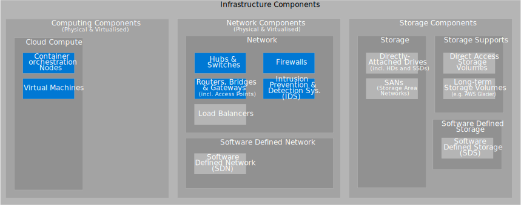

Altinn Studio consists of three different technical solutions to make a complete application development platform.

[Download as Visio](infrastructure_components.vsdx)

[Download as Visio](altinn_infrastructure.vsdx)

{}
