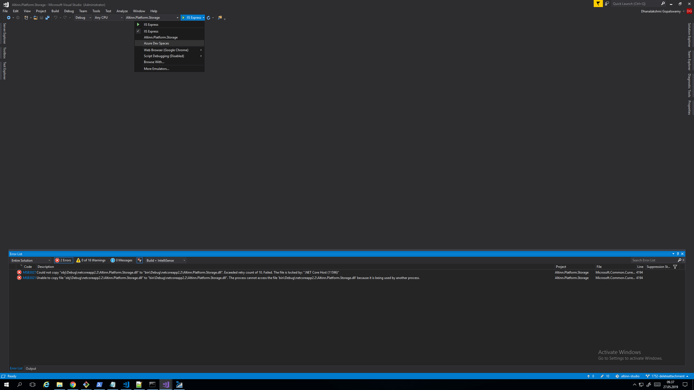

{}
This page is a work-in-progress. Currently we don't have azure dev spaces set up for tjeneste 3.0 
{}

### Azure Dev Spaces
Azure dev spaces is an offering from Azure for a rapid, iterative Kubernetes development experience for teams. AZDS gives the opportunity to iteratively run and debug containers directly in Azure Kubernetes Service (AKS) with minimal dev machine setup. You can read more about AZDS, setup and configuration for visualstudio or Visualstudiocode [here](https://docs.microsoft.com/en-us/azure/dev-spaces/).

#### Enable Azure Dev Spaces in Storage
Once you install the visual studio or visual studio code extensions for azure dev spaces, you should see the option for azure dev spaces in debug tool. 

On selecting the azure dev spaces option for a selected project, azure dev spaces configuration modal popsup where you must select the subscription, cluster name and space.

Azure dev spaces tools for Visual studio automatically generates the required helm charts and dockerfile for the first time.

The application is then deployed to the selected dev space and ready for debugging.