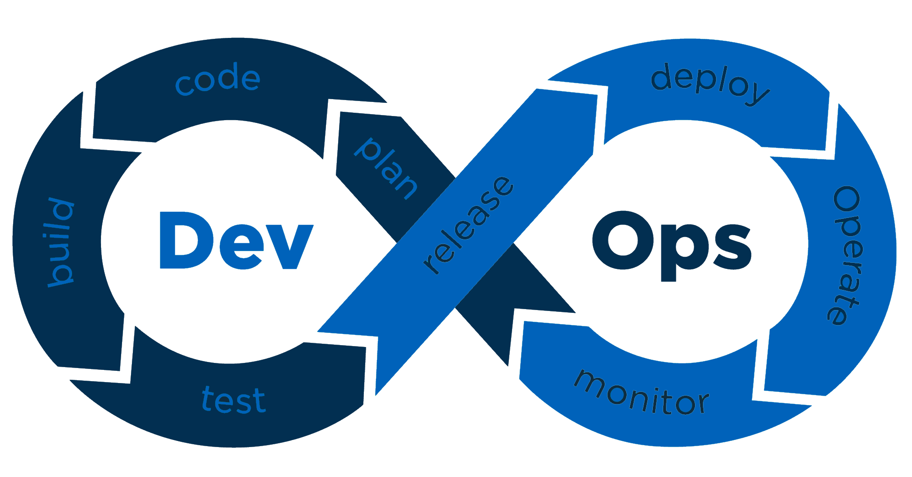

Security is an important concern in all the phases of the DevOps cycle

## Planning phase

During the planning phase the requirements for features are gathered.

Already in this phase we identify changes that needs special security considerations. Typical this is done as part of grooming.

We mark our security releated features and bugs to a [specific label](https://github.com/Altinn/altinn-studio/issues?q=is%3Aopen+is%3Aissue+label%3Akind%2Fsecurity).

Details of security related issues are in many cases kept out of github.

## Code phase

During development of a feature we have serveral processes and tools to help us creating secure code.

### Development checklists

We have development checklist that ensure that developers and reviewers consider the different security aspects

### IDE and tools

We use both Visual Studio and Visual Studio code. Those provides us with tools for static code analysis.

- StyleCop analyzes C# source code to enforce a set of style and consistency rules. [See project](https://github.com/DotNetAnalyzers/StyleCopAnalyzers)
- [Code Analysis](https://docs.microsoft.com/en-us/visualstudio/code-quality/roslyn-analyzers-overview?view=vs-2019) verifes the code after a [ruleset defined by Altinn](https://github.com/Altinn/altinn-studio/blob/master/Altinn3.ruleset)

## Build phase

Once a developer has finished coding of a feature he/she creates a pull request in our repository.

### Peer Reviews

All pull requests requires peer review from at least on team member from the Altinn Devops team.

See active pull requests.

### Static code analysis

#### Sonar Cloud

Every pull request is analyzed by [Sonar Cloud](https://www.sonarcloud.io/github)

#### LGTM

[LGTM](https://github.com/marketplace/lgtm) is a code analysis platform for identifying vulnerabilities and preventing them from reaching production.

This is run for every pull request.

Each part is important to ensure that Altinn 3 is secure.

## Processes

### Code Reviews

All code merged to our master branch needs to be reviewed by at least one other team member. 

### Testing

Each feature added to our platform is tested.

- Integration tested with positive and negative tests for access control where possible
- Manual functional tests
- Manual security testing for selected features

### Evauluation of open source libraries

Before any new library is added to

## Tools

### Dynamic code analysis

## Patterns

## Coding checklist

### Access Control 

  
### 