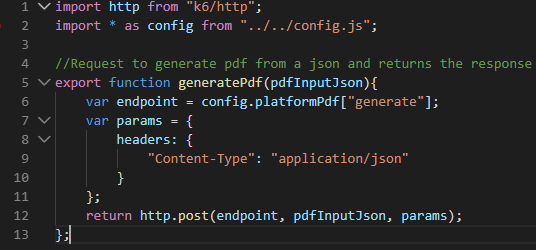
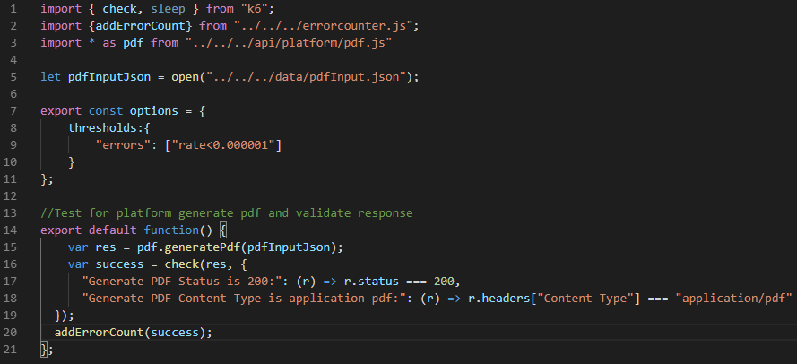
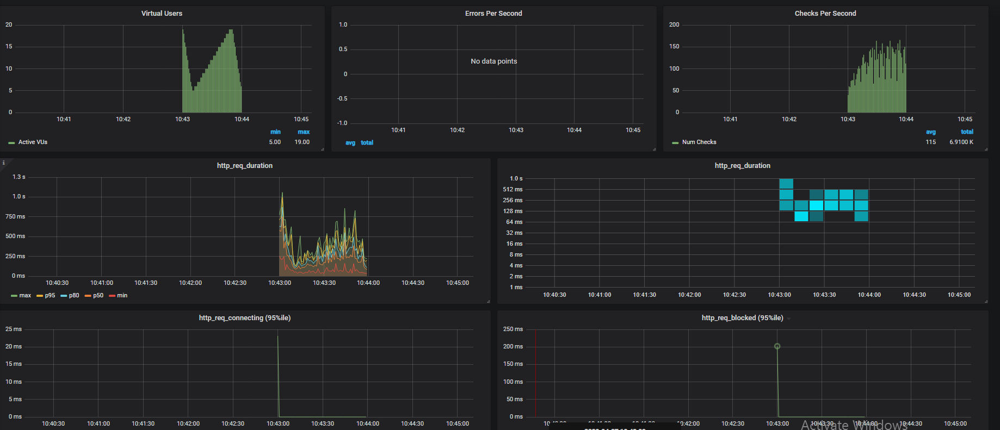

k6 is a developer-centric, free and open-source load testing tool built for making performance testing a productive and enjoyable experience. [read more about K6 here](https://k6.io/docs/)

### Set up k6 tests

1. Clone the k6 tests from [GitHub Repo](https://github.com/Altinn/altinn-studio/tree/master/src/test/K6/src)
2. Install docker and make sure the drive having the k6 tests is shared.
3. Open cmd and download the latest k6 docker image `docker pull loadimpact/k6`

### How to write k6 tests

1. Find the area/collection where the new test has to be added.
2. k6 test project is divided into three basic folders.
    - tests - includes all the .js test files that send data to methods in api and validated response
    - data - includes all the testdata ex., attachments, formdata, appmetadata, etc.,
    - api - includes the api calls to platform/app apis by getting data from the tests and returns the response of the http requests. (post, get, put, delete)
3. Begin by adding the endpoint to _config.json_
4. Create a new method for the actual api in a .js file under folder `K6/src/api` which gets in data from the tests and returns response. Refer below picture for a sample method calling an api with endpoint and headers and returning the response.

5. Create a test .js file under `K6/src/tests`. Refer below picture for a sample test file.

[More about k6 test scripts](https://k6.io/docs/using-k6/test-life-cycle)
6. One test can call many api endpoints with appropriate data, the result output of the test is determined by the __checks__ in a tests and the __thresholds__ defined in a test.
[More about k6 test checks and thresholds](https://k6.io/docs/using-k6/checks)

### Run k6 tests locally with a k6 docker image and visualize results in grafana

- Before a test can be run, the files mentioned under **.gitignore** has to be created under the data folder.
- In cmd, change directory to `\altinn-studio\src\test\K6`
- Download and run docker containers of influxdb and grafana

```cmd
docker-compose up -d influxdb grafana
```

- Open `http://localhost:3000/` in a browser and the dashboard gets preloaded and is visible under 'Recently viewed dashboards'.
- Run the below example command where pdf.js testscript is run for 1 minute with a maximum of 20 virtual users and with a ramp up and ramp down of virtual users.
The testscript targets 5 vus for first 10 seconds, targets 20 vus for next 40 seconds and ramps down to 5 vus for the last 10 seconds.

```cmd
docker-compose run k6 run --vus=20 --stage 10s:5,40s:20,10s:5 /src/tests/platform/pdf/pdf.js -e env=value
```

- Once the above script it run, one could see results in grafana similar to the below image.


### k6 test pipeline in Azure Devops

[Azure Devops Pipeline for Platform](https://dev.azure.com/brreg/altinn-studio/_build?definitionId=96)

[Azure Devops Pipeline for App](https://dev.azure.com/brreg/altinn-studio/_build?definitionId=118)

### Visualizing k6 results

k6 by default outputs in stdout format while running a test. Below is described various methods to visualise results.

- To get a junit.xml output from k6 tests, pipe the results to a k6-to-junit npm package with file name. (use `npm install -g k6-to-junit@1.0.2` to install the package globally).
This comes in handy to view test results in CI/CD pipelines.

```cmd
docker run -i -v C:/Repos/altinn-studio/src/test/K6/src/:/src loadimpact/k6 run src/tests/platform/pdf/pdf.js -e env=value | k6-to-junit results.xml
```

- k6 performance test results can be visualised with the help of a influxdb and grafana instance that stores and reads the test results and displays as graph.
[More about influxdb and grafana results](https://k6.io/docs/results-visualization/influxdb-+-grafana)

### Initial results from a sample tests against performance test environment

- Test case: Login - Build test data - Create instance - Upload formdata - validate and archive instance
- Http-requests: 14
- Iteration: 1
- Iteration duration: ~27 seconds
- Average http_req_duration : 1.9s
