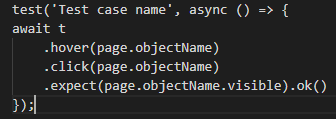
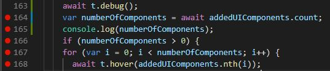

This document describes how one can start writing tests on a test cafe project , and debug of the tests.

### Procedure to write general testcafe test

1. Find a test case and area that has to be automated.
2. Find the '-tests.js' file that the test case has to be added or create a new folder and new .js file for the test under src/test/Testcafe.
3. Identify and add the page objects with the selectors information under respective file under src/test/Testcafe/page-objects.
4. Identify the need for methods that can be reused by other tests and add it under the page object file.
5. Each '-tests.js' file has headers that import the necessary page objects.
6. Fixtures innholds URL, before and aftereach test procedures.
7. Test cafe tests has a basic format as below.

### Debug Tests

1. Use 't.debug()' in a testcafe test to start debugging of the test.
2. Use breakpoints for the steps to be debugged.
3. Use 'console.log(variable_name)' to find the runtime value of an variable - which will be logged in VS Code Terminal.

4. Rename the test to “test.only” - this will only run the specific test case.
5. in testRunner.js, Set “chrome” as browser, Reduce the speed to 0.8 (percentage), debugOnFail : True, stopOnFirstFail: True
6. Use '--inspect --debug-brk' in the command line when starting the tests.
7. Check for the logs in junit.xml.
5. Testcafe continues to work towards implementing a method to debug an application interactively. Refer: <https://github.com/DevExpress/testcafe/issues/3244>

### Basics on POM and Selectors

 1. config.json has the URLs and app names used in different environment
 2. Use of objects from POM
     - Import page – 'import page_name from path_to_the_file
     - Declare an object for the page - let object_name = new page_name();
 3. Selectors
     - Id – starts with ‘#’
     - Class – starts with ‘.’
     - Html -> “ul > li”
 4. test.skip – to skip a test in a test run (The results for the tests goes to Others)

[More about Selectors](https://devexpress.github.io/testcafe/documentation/test-api/selecting-page-elements/selectors/)
