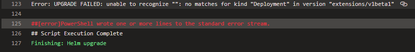
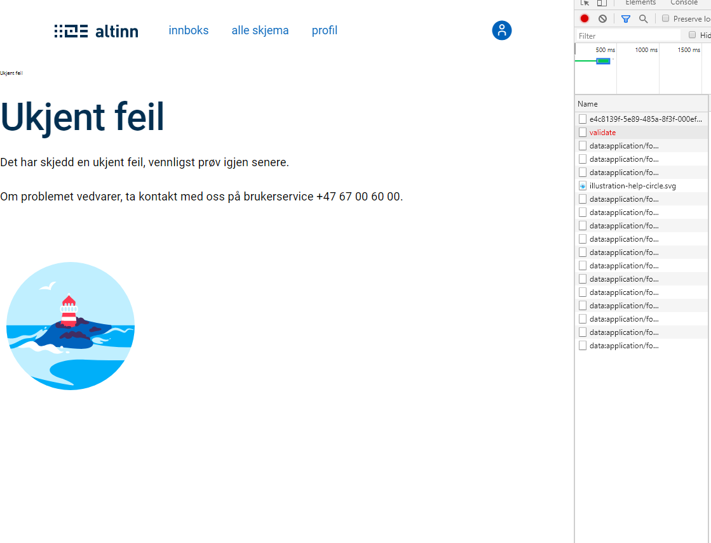
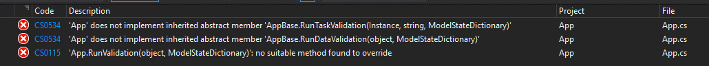
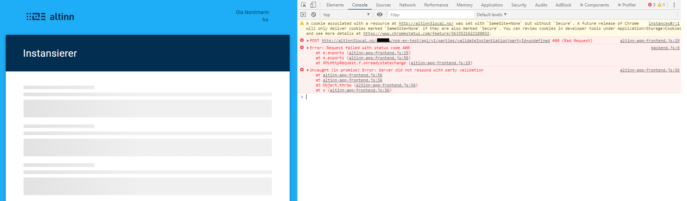
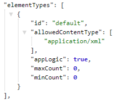
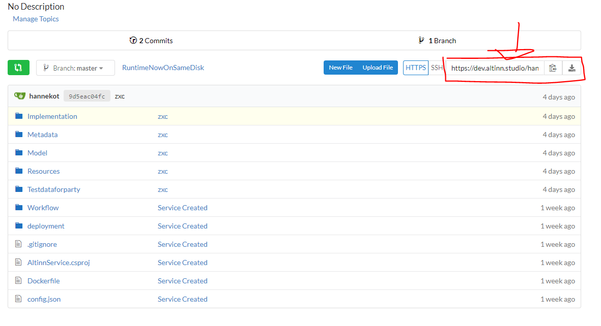
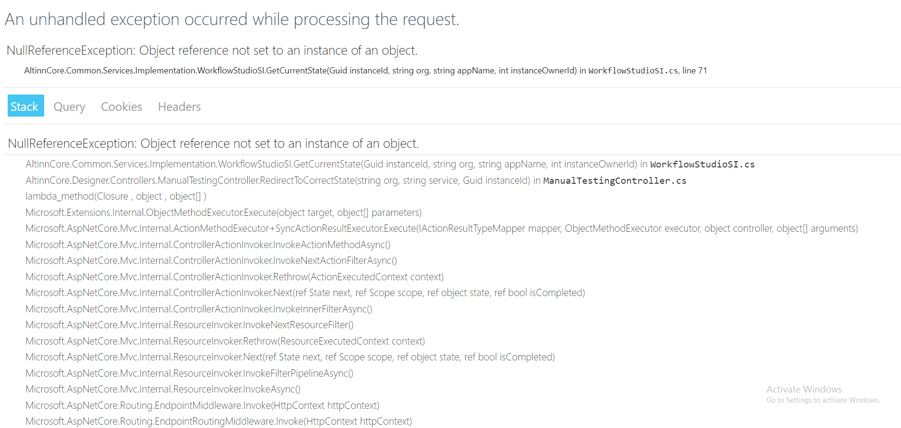

## Breaking change: Deploy pipeline fails with error: UPGRADE FAILED

Introduced with upgrade of AKS cluster.
The api version (extensions/v1beta1) used to deploy apps
to the AKS cluster is no longer supported.

### Errors

When triggering deploy from altinn.studio the deploy fails.
On closer inspection of the pipeline (byggloggen)
the error message below is shown at the end of the failed step.



### How to fix

To fix this issue  the deployment to use a new api version.
Navigate to you application repository and find *deployment.yaml*.
It is placed in the folder *deployment/templates*.

Make the changes spesified below to the file, and update the repository.
Remember to pull the latest version in altinn.studio before attempting to re-deploy.


1. Change apiVersion from extensions/v1beta1 to apps/v1.

2. Add the following lines under _replicas_ in the _spec_ section.
Be ware of indentation here. Two spaces are used as indent for sub sections.

```yaml
selector:
  matchLabels:
    app: {{ template "name" . }}
```

## Breaking change: Send-in / Validation fails with 'Ukjent feil'

Introduced with issue: [#3927](https://github.com/Altinn/altinn-studio/issues/3927)
There was a vulnerability in the solution allowing to update a whole instance object
using an endpoint in app backend or storage. This has been solved by refactoring app backend
and removing the endpoints.

### Error

When sending in an instance after completing form filling the error below i prompted.
In network you can see that the 'validate'-request receives a 500 code in response.



### How to fix

Navigate to you application repository and find App.csproj.
Upgrade the three Altinn.App nugetpackages to version 1.0.78.

```xml
    <PackageReference Include="Altinn.App.Api" Version="1.0.78-alpha" />
    <PackageReference Include="Altinn.App.Common" Version="1.0.78-alpha" />
    <PackageReference Include="Altinn.App.PlatformServices" Version="1.0.78-alpha" />
```

## Breaking change: Validation fails for attachments in some cases after 30.03.2020
Introduced with issues: [#1925](https://github.com/Altinn/altinn-studio/issues/1925) and [#3915](https://github.com/Altinn/altinn-studio/issues/3915)
In Altinn Studio, all data types that were created from a FileUpload component were set with `allowedContentTypes: [application/octet-stream]`
as default. This was also set for all uploads from the app. This has now been changed, so that the 
file types defined by the app developer are also set in `allowedContentTypes`, and the file upload is sent
with the corresponding `Content-Type` of the file in the request header.

### Error
Apps that were created before the fix was implemented (30.03.2020) may experience that validation 
fails for the attachment, even though it is of the correct format specified in Altinn Studio. This is 
because the dataType for the attachment expects `application/octet-stream`, but instead receives the actual
mime type for the uploaded file.

### How to fix
Update `allowedContentTypes` for the data type that fails. This can either be done manually in the applications 
`applicationMetadata.json` for the affected data type(s) or by updating the FileUpload component in Altinn Studio
so that the expected `allowedContentTypes` are saved. 

After updating, the app must be re-deployed.

## Breaking change: Build fails after upgrading Altinn.App-nugets to version 1.0.62-alpha
Introduced with issue: [#3820](https://github.com/Altinn/altinn-studio/issues/3820)
The base class that every application inherits has been altered to allow for both data and task validation. 

### Error
When building App.cs errors simillar to those depicted in the picture below are logged.


### How to fix

If you haven't made any changes to `App/logic/Validation/ValidationHandler.cs` and `App/logic/App.cs`
the quickest way to fix the build errors are to copy these files from the template and paste them into your repository. 
Find the template files [here.](https://github.com/Altinn/altinn-studio/tree/master/src/studio/AppTemplates/AspNet/App/logic) 

If changes have been made to these files, follow the instructions below to fix the errors.

#### App/logic/Validation/ValidationHandler.cs

1. Add a reference to _Altinn.Platform.Storage.Interface.Models_ by including the snippet below amongst the using statements.

    ```cs
    using Altinn.Platform.Storage.Interface.Models;
    ```

2. Add the function below in the class.

    ```cs
    public async Task ValidateTask(Instance instance, string taskId, ModelStateDictionary validationResults)
    {
        await Task.CompletedTask;
    }
    ```

#### App/logic/App.cs

1. Rename function `RunValidation` to `RunDataValidation`
2. Add the function below in the class

```cs
        /// <summary>
        /// Run validation event to perform custom validations
        /// </summary>
        /// <param name="validationResults">Object to contain any validation errors/warnings</param>
        /// <returns>Value indicating if the form is valid or not</returns>
        public override async Task RunTaskValidation(Instance instance, string taskId, ModelStateDictionary validationResults)
        {
            await _validationHandler.ValidateTask(instance, taskId, validationResults);
        }
```

## Breaking change: Error message when deleting instance from messagebox

Introduced with issue: [#2487](https://github.com/Altinn/altinn-studio/issues/2487)
A new policy has been introduced for deleting instances which is not included in the policy file for
apps created in altinn.studio before 10.03.2020.

### Error
When delting an active or archived instance from Altinn Portal (Messagebox) the user is prompted with an error.

### How to fix
The new rule must be included in the policy file. Once this is done, 
build and redeploy your applicatin to all relevant environments.

Navigate to _App/config/authorization/policy.xml_ in your repository and add the following rule. 
**OBS!** [ORG] and [APP] tags must be replaced with your organisation code and application name.

```xml
    <xacml:Rule RuleId="urn:altinn:example:ruleid:4" Effect="Permit">
    <xacml:Description>Rule that defines that user with role REGNA or DAGL can delete instances of [ORG]/[APP]</xacml:Description>
    <xacml:Target>
      <xacml:AnyOf>
        <xacml:AllOf>
          <xacml:Match MatchId="urn:oasis:names:tc:xacml:3.0:function:string-equal-ignore-case">
            <xacml:AttributeValue DataType="http://www.w3.org/2001/XMLSchema#string">REGNA</xacml:AttributeValue>
            <xacml:AttributeDesignator AttributeId="urn:altinn:rolecode" Category="urn:oasis:names:tc:xacml:1.0:subject-category:access-subject" DataType="http://www.w3.org/2001/XMLSchema#string" MustBePresent="false"/>
          </xacml:Match>
        </xacml:AllOf>
        <xacml:AllOf>
          <xacml:Match MatchId="urn:oasis:names:tc:xacml:3.0:function:string-equal-ignore-case">
            <xacml:AttributeValue DataType="http://www.w3.org/2001/XMLSchema#string">DAGL</xacml:AttributeValue>
            <xacml:AttributeDesignator AttributeId="urn:altinn:rolecode" Category="urn:oasis:names:tc:xacml:1.0:subject-category:access-subject" DataType="http://www.w3.org/2001/XMLSchema#string" MustBePresent="false"/>
          </xacml:Match>
        </xacml:AllOf>
      </xacml:AnyOf>
      <xacml:AnyOf>
        <xacml:AllOf>
          <xacml:Match MatchId="urn:oasis:names:tc:xacml:1.0:function:string-equal">
            <xacml:AttributeValue DataType="http://www.w3.org/2001/XMLSchema#string">[ORG]</xacml:AttributeValue>
            <xacml:AttributeDesignator AttributeId="urn:altinn:org" Category="urn:oasis:names:tc:xacml:3.0:attribute-category:resource" DataType="http://www.w3.org/2001/XMLSchema#string" MustBePresent="false"/>
          </xacml:Match>
          <xacml:Match MatchId="urn:oasis:names:tc:xacml:1.0:function:string-equal">
            <xacml:AttributeValue DataType="http://www.w3.org/2001/XMLSchema#string">[APP]</xacml:AttributeValue>
            <xacml:AttributeDesignator AttributeId="urn:altinn:app" Category="urn:oasis:names:tc:xacml:3.0:attribute-category:resource" DataType="http://www.w3.org/2001/XMLSchema#string" MustBePresent="false"/>
          </xacml:Match>
        </xacml:AllOf>
      </xacml:AnyOf>
      <xacml:AnyOf>
        <xacml:AllOf>
          <xacml:Match MatchId="urn:oasis:names:tc:xacml:1.0:function:string-equal">
            <xacml:AttributeValue DataType="http://www.w3.org/2001/XMLSchema#string">delete</xacml:AttributeValue>
            <xacml:AttributeDesignator AttributeId="urn:oasis:names:tc:xacml:1.0:action:action-id" Category="urn:oasis:names:tc:xacml:3.0:attribute-category:action" DataType="http://www.w3.org/2001/XMLSchema#string" MustBePresent="false"/>
          </xacml:Match>
        </xacml:AllOf>
      </xacml:AnyOf>
    </xacml:Target>
  </xacml:Rule>

```

## Breaking change: re-arranging order for calls for app frontend

Introduced with issue: [#3625](https://github.com/Altinn/altinn-studio/issues/3625)
All applications retrieve the same javascript file for application frontend, however all applications are not updated with the latest nuget version of the three Altinn.App nuget packages.
This results in an incompatability when rendering application frontend.

### Error
When instantiating an application either locally or in a test environment the page keeps loading.
Checking the network calls will reveal that is a POST request with query parameter `partyId=undefined` that receives a 400 response.


### How to fix
Update nuget versions for the Altinn.App packages in _App.csproj_. Version should be 1.0.48.  

```c#
 <PackageReference Include="Altinn.App.Api" Version="1.0.48-alpha" />
 <PackageReference Include="Altinn.App.Common" Version="1.0.48-alpha" />
 <PackageReference Include="Altinn.App.PlatformServices" Version="1.0.48-alpha" />
```

## Breaking change: updated traefik in app clusters

Introduced with issue: [#3325](https://github.com/Altinn/altinn-studio/issues/3325)

Old apps were configured to work with traefik 1.x.x. We have now updated the traefik versjon to 2.1.4, and the app helm charts have therefore been updated. This means that old helm charts are no longer usable.

### Errors
Deploy of app fails with error: UPGRADE FAILED: template: deployment/templates/ingress.yaml:1:14: executing "deployment/templates/ingress.yaml" at <.Values.ingress.enabled>: nil pointer evaluating interface {}.enabled. 


### How to fix
Replace all content in the `deployment` folder in the app repo with the content found in the `altinn-studio\src\Altinn.Apps\AppTemplates\AspNet\deployment` from the [altinn studio github repo](https://github.com/Altinn/altinn-studio)


## Error when trying to deploy an app to any environment (AT21, AT23)
Introduced with issue: [#1158](https://github.com/Altinn/altinn-studio/issues/1158) which was implemented in relation with issue [#2757](https://github.com/Altinn/altinn-studio/issues/2757)

### Errors
When deploying your app to an environment (AT21, AT23) and you get an error box appearing from the "Deploy new version"-button with a 404 statuscode, it could mean that the server can't find the Authorization folder and policy.xml residing within.

### How to fix
Make sure the Gitea repository connected to the relevant app contains (on the root level) a folder named Authorization and the folder contains a file named policy.xml.

If there is no folder named Authorization, add the folder and within the folder, add policy.xml. Inside the policy.xml file, you need to change {org} to the relevant organisation and {app} to the relevant application name.

Here is the [policy.xml](policy.xml).

If you have a folder named Authorization but there is no policy.xml file within it, add the file with the procedure described above.

## Breaking change: data element validation returns an internal server error to app frontend

Introduced with issue: [#2457](https://github.com/Altinn/altinn-studio/issues/2457)

Old apps created in Altinn Studio had no connection between the current process task and the date element it was allowed to change data on.
This caused a `System.NullReferenceException` error in the  AltinnCore.Runtime.RestControllers.ValidateController.ValidateData endpoint when running validtions against the data element.

### How to fix
Log onto the altinn.studio and access the application metadata file: https://altinn.studio/repos/{org}/{app}/src/branch/master/Metadata/applicationmetadata.json

In the `elementTypes` object, locate the object with the id `default`. This looks something like this:

```json
{
    "id":"default",
    "allowedContentType":["application/xml"],
    "appLogic":true,
    "maxCount":0,
    "minCount":0
}
```

This object should be extended with the following property `"task":"Task_1",`. After this is added, the object should look like this

```json
{
    "id":"default",
    "allowedContentType":["application/xml"],
    "appLogic":true,
    "task": "Task_1",
    "maxCount":0,
    "minCount":0
}
```

## Breaking change: Deploy fails with error "The current .NET SDK does not support targeting .NET Core 3.0"
Introduced with issue: [#2762](https://github.com/Altinn/altinn-studio/issues/2762)

When an application is deployed the latest Runtime image is copied from Azure Container Registery. As this image will be based
on ASP.NET Core 3.0 the application must also specify that it should run on the same version. For all applications created before 
21.10.2019 the specified version in .ASP.NET Core 2.2, and this must be changed.

### How to fix
Log onto altinn.studio and access the Dockerfile using this url: https://altinn.studio/repos/{org}/{app}/src/branch/master/Dockerfile
Edit line 9 from ```FROM microsoft/dotnet:2.2-aspnetcore-runtime AS final``` to ``` FROM mcr.microsoft.com/dotnet/core/aspnet:3.0-alpine AS final```

The complete dockerfile should now look like the example below.

```
#altinn-runtime with sdk
FROM altinntjenestercontainerregistry.azurecr.io/altinn-runtime:latest AS build
WORKDIR /AltinnService/
COPY AltinnService.csproj ./
COPY Implementation/* ./
COPY Model/*.cs ./
RUN dotnet publish -o publish/

FROM mcr.microsoft.com/dotnet/core/aspnet:3.0-alpine AS final
WORKDIR /app

#copy altinn-runtime app
COPY --from=build /app .

#copy service
WORKDIR /AltinnService/bin/
COPY --from=build /AltinnService/publish/AltinnService* ./
WORKDIR /AltinnService/
COPY . .
WORKDIR /app

#entrypoint
ENTRYPOINT ["dotnet", "AltinnCore.Runtime.dll"]
```

## Breaking change: Added parameter to identify form data in applicationMetadata file
Introduced with issue: [#2592](https://github.com/Altinn/altinn-studio/issues/2592)

When posting data to an instance the element type should be specified. default is currently used to identify form data, 
and in application metadata there is a boolean to indicate that elements of thios type are form data. 
This will cause POST requests to https://{{appOwner}}.apps.{{platformUrl}}/{{appOwner}}/{{appName}}/instances/{{instanceOwnerId}}/{{instanceId}}/data?elementType=default
to fail if application metadata has not been updated.

### How to fix
Set appLogic equal to true for element type with id 'default'.
Log onto altinn.studio and access the metadata file using this url: https://altinn.studio/repos/{org}/{app}/src/branch/master/Metadata/applicationmetadata.json
Edit the default element type in the metadata to match the example below


## Breaking change: Url for application repository is updated.
Introduced with issue: [#2029](https://github.com/Altinn/altinn-studio/issues/2029)

It is no longer possible to access repositories in Gitea through https://altinn.studio/{org}/{app}.
This is due to changes made in backend routing with release v2019.27, url to Gitea and the application repositories now requires a /repos.

### How to fix
To access your repository go to: https://altinn.studio/repos/{org}/{app}

## Error -The type or namespace name *
Introduced with issue: [#875](https://github.com/Altinn/altinn-studio/issues/875)

### Errors

When compiling C# files for a given service application the following errors occurs:

- ServiceImplementation.cs - The type or namespace name 'IPlatformServices' could not be found (are you missing a using directive or an assembly reference?)
- ServiceImplementation.cs - The type or namespace name 'IServiceImplementation' could not be found (are you missing a using directive or an assembly reference?)
- ServiceImplementation.cs - The type or namespace name 'RequestContext' could not be found (are you missing a using directive or an assembly reference?)
- ServiceImplementation.cs - The type or namespace name 'ServiceContext' could not be found (are you missing a using directive or an assembly reference?)
- ServiceImplementation.cs - The type or namespace name 'StartServiceModel' could not be found (are you missing a using directive or an assembly reference?)
- ValidationHandler.cs - The type or namespace name 'RequestContext' could not be found (are you missing a using directive or an assembly reference?)

### How to fix

Make the following updates to the application repo (https://altinn.studio/{org}/{app}):

- /AltinnService.csproj (update to latest nuget package)


- Implementation/ServiceImplementation.cs


- Implementation/Validation/ValidationHandler.cs


## Error - 'ServiceImplementation' does not implement interface member *
Introduced with issue: [#142](https://github.com/Altinn/altinn-studio/issues/142) and [#875](https://github.com/Altinn/altinn-studio/issues/875).

### Errors

When compiling C# files for a given app the following errors occurs:

- ServiceImplementation.cs - Error - 'ServiceImplementation' does not implement interface member 'IServiceImplementation.SetContext(RequestContext, ServiceContext, StartServiceModel, ModelStateDictionary)'
- ServiceImplementation.cs - Error - 'ServiceImplementation' does not implement interface member 'IServiceImplementation.SetContext(RequestContext)'

### How to fix

Make the following updates to the application repo (https://altinn.studio/{org}/{app}):

- /AltinnService.csproj (update to latest nuget package)


- Implementation/ServiceImplementation.cs


## Breaking change: Change storage format of form layout

After we have rewritten the runtime react application, we will also introduce a new format the layout is saved as.
This change will be pushed in the transition between May and June 2019.

### How to fix

If you don't want to end up with a empty layout un the UI-editor, send a <a href="mailto:extmgm@brreg.no">mail</a> with the name of the organization and the repo-name.
And an admin will convert your formLayout.json to the new format.

## Cannot deserialize the current JSON object
Introduced with [issue #991](https://github.com/Altinn/altinn-studio/issues/142).

Cannot deserialize the current JSON object (e.g. {"name":"value"}) into type 'System.Collections.Generic.List'1[AltinnCore.Common.Models.Data]'
because the type requires a JSON array (e.g. [1,2,3]) to deserialize correctly....

### Errors

Error when trying to test app:


- ServiceImplementation.cs - Error - 'ServiceImplementation' does not implement interface member 'IServiceImplementation.SetContext(RequestContext, ServiceContext, StartServiceModel, ModelStateDictionary)'
- ServiceImplementation.cs - Error - 'ServiceImplementation' does not implement interface member 'IServiceImplementation.SetContext(RequestContext)'

### How to fix

Make the following updates to the application repo (https://altinn.studio/{org}/{app}):

- Delete all files under the 'Testdataforparty', this has to be done by deleting one by one file:


- or you can clone your app by using git clone, then remove the files from the clone folder, git add to specify which files to check in, git commit -m to commit and git push to push changes to master (git clone urlToApp):



- if help is needed send a <a href="mailto:extsbu@brreg.no">mail</a> with the name of the organisation and the repo-name.

## Error when trying to open an archived instance in message box
Introduced with issue: [#1771](https://github.com/Altinn/altinn-studio/issues/1771).

### Errors
When opening an archived instance instanciated before the 24.06.2019, the following error message is prompted:



### How to fix
There is no fix for this breaking change. New instances of the app must be instanciated. 
