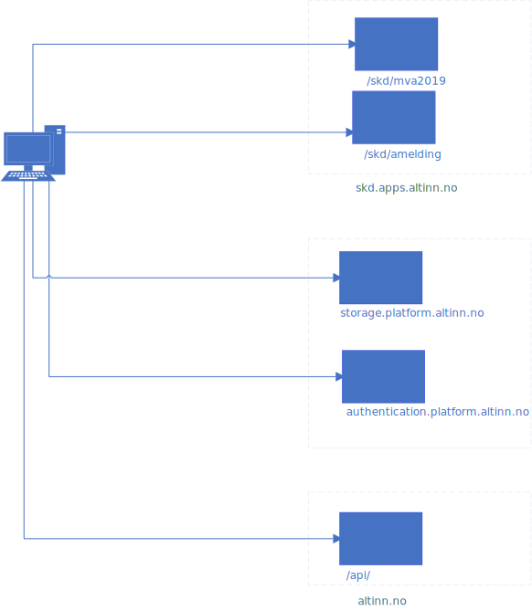

{}
NOTE: Work in progress. Stuff will change
{}

The main API-channel for data in the platform is REST for apps created in Altinn Studio. 

The end user system needs to call different APIS based on the need.
The below figure show the different components relevant for an end-user system calling Altinn through REST.

[Download as Visio](eus-rest.vsdx).

## API to authenticate end user systems 
For new API's the goal is to use JWT Tokens to authenticate against the API. 

Altinn Apps will expose apis to authenticate end user systems and user of end user systems and return JWT Tokens that can be used against the other API's. 

## API to create new data instance for an app
From end user systems it will be possible to create a instance of an App from a end user system. 
This is a URL directly to the app and unique.

See [Application Users API](/altinn-api).
