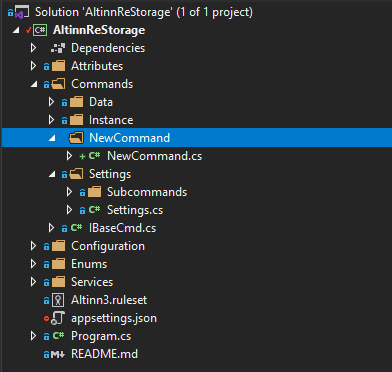
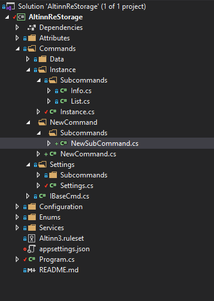

Altinn ReStorage can be found on [GitHub](https://github.com/Altinn/altinn-tools/tree/master/AltinnReStorage).

## Concepts

The consepts of the application are releated to the different parts of a command line command.

Example: `data info -ig e415477d-7964-4ffe-97b1-4b2cbf7ba8fe -lv`

Command: _data_

SubCommand: _info_

Options:

- _-ig e415477d-7964-4ffe-97b1-4b2cbf7ba8fe_
- _-lv_

### Command

The name of the command gives an indication of which type of resource the user wishes to interact with.

### SubCommand

The sub command defines the operation to be performed on the command resource

### Option

An option is a named parameter that is passed to the command.

## Commands

Commands and examples of their usage are available on [GitHub](https://github.com/Altinn/altinn-tools/tree/master/AltinnReStorage).

## Software implementation

The command line interface is implemented using the popular [CommandLineUtils library](https://github.com/natemcmaster/CommandLineUtils) written by [natemcmaster](https://github.com/natemcmaster).
In this section the file structure of the project is describes and code samples on how to add new commands.

### Folder structure structure

This section gives an overview of the most important folders and files in the project.
Hopefully, making it clear how to include new files into the project and where to place them.

__Attributes__ A folder containing attribute validation classes used to verify command line options.

__Commands__ A folder containing _IBaseCmd.cs_ and a folder for each command e.g. data.

__IBaseCmd.cs__ An interface that all commands and subcommand classes must inherrit.

__Data__  A folder containing the subfolder _Subcommands_ and Data.cs

__Services__ A folder containing service interfaces and their implementation.

### How to ...

This section contains instructions the most common development tasks when expanding the tool.

- [...  add a new root command](#-add-a-new-root-command)
- [... add a new subcommand](#-add-a-new-sub-command)
- [... add a new option to a command](#-add-a-new-option-to-a-command)
- [... validate an option](#-validate-an-option)
- [... add a new service](#-add-a-new-service)

#### ... add a new root command

1. Create a new folder using the name of the command and include a new class with the same name.
    

2. Make the class an extention of the _IBaseCmd_ interface.

    ```cs
        public class NewCommand : IBaseCmd
        {
        }
    ```

3. The command attribute must be set on the class
    It is possible to add more parameters, explore which ones might be usefor for your command.
    The ones listed below are suggested as a minimum for all commands. The _name_ parameter is
    what will be used to navigate to this command when running the app. *Note that the name should be all lower case.*

    ```cs
    using McMaster.Extensions.CommandLineUtils;

    [Command(
        Name = "newcommand",
        OptionsComparison = StringComparison.InvariantCultureIgnoreCase,
        UnrecognizedArgumentHandling = UnrecognizedArgumentHandling.CollectAndContinue)]
        public class NewCommand :IBaseCmd
        {
        }
    ```

    Note that the McMaster nugetpackage is references in the class.

4. Inlcude the override of the OnExecuteAsync from the base class.
 The implementation below will show the help for the command and then complete the task.
 If the command does not have any sub commands simply remove `app.ShowHelp();` and include your own implementation.

    ```cs
    /// <inheritdoc/>
    protected override Task OnExecuteAsync(CommandLineApplication app)
    {
        app.ShowHelp();
        return Task.CompletedTask;
    }
    ```

    Place all logic and operations you wish to be executed when the command is called.
    If you require any input parameters check the how to section for this below.

5. The new command should now be included in _Program.cs_.
    This is so that the command is recognized and executed when inputed in the running program.

    Add a new parameter:

    ```cs
    private static readonly CommandLineApplication<NewCommand> _newCommandCmd = new CommandLineApplication<NewCommand>();
    ```

    In the Task function the standard conventions are set for the new command and all DI services are made available.

    ```cs
    _newCommandCmd.Conventions
                .UseDefaultConventions()
                .UseConstructorInjection(serviceProvider);
    ```

6. Finally the command must be added to the switch case that identifies the input and routes it to the correct 
CommandLineApplication. Extend the switch case a shown below.

    ```cs
    case "newcommand":
        await _newCommandCmd.ExecuteAsync(args);
        break;
    ```

    The standard error message in the default clause of the loop
    should also be modified to include the new command.

    ```cs
    default:
        Console.WriteLine($"Unknown argument {string.Join(" ", args)}, Valid commands are data, instance and settings.");
        break;
    ```

#### ... add a new sub command

1. Add a new class in the correct _Subcommands_-folder. It there is not subcommands folder for the command, please create this first. 
The class should share a name with the sub command.

    

2. The command attribute must be set on the class
    _Name_ should be in lower case and match the class name. Note that the McMaster nugetpackage must be references to use the Command attribute.

    ```cs
    [Command(
        Name = "newsubcommand",
        OptionsComparison = StringComparison.InvariantCultureIgnoreCase,
        UnrecognizedArgumentHandling = UnrecognizedArgumentHandling.CollectAndContinue)]
    public class NewSubCommand :IBaseCmd
    {
    }
    ```

3. The root command must include a reference for the new subcommand, so navigate back to newCommand.cs
    Add the following attribute to the class `[Subcommand(typeof(NewSubCommand))]`.
    If the class has multiple sub commands simply comma seperate them as such:

    ```cs
    [Subcommand(typeof(NewSubCommandA),typeof(NewSubCommandB), typeof(NewSubCommandC))]
    ```

4. Make the class an extention of _IBaseCmd_ and include an override of the _OnExecuteAsync_ method.

    ```cs
    public class NewCommand : IBaseCmd
    {
        protected override Task OnExecuteAsync(CommandLineApplication app)
        {
            return Task.CompletedTask;
        }
    }
    ```

    OnExecuteAsync will be triggered whenver the subcommand is called, so this is where all logic
    should be implemented. If you require input parameters check the how to below. If you require
    services through dependency injection a constructor should be included in the blass.

#### ... add a new option to a command

An option is simply implemented as a public property in the command class with an _option_ attribute included.
There are several input parameters for the options attribute. The ones belowe are what we suggest, but feel free to add more parameters if you require.

```cs
[Option(
    CommandOptionType.SingleValue,
    ShortName = "dg",
    LongName = "dataGuid",
    ShowInHelpText = true,
    Description = "DataGuid for the data element.")]
public string DataGuid { get; set; }
```

Not that the command class is not instantiated with each new command, so if you have some optional parameters, ensure that these are reset for their default value 
after the command is executed.

#### ... validate an option

Instead of validating the format of an option that is shared by several commands in each command where it is used
it is easier to create a validation class and simply include this attribute on the option. This way validation
is triggered before the command is even executed, notifying the user about their incorrect input. 

All validation attribute classes must extend _ValidationAttribute_ and override the validation method.
See [GuidAttribute](https://github.com/Altinn/altinn-tools/blob/master/AltinnReStorage/Attributes/GuidAttribute.cs) for an example.

If an option is required add the `[Required]` as an attribute on the property.

#### ... add a new service

1. Define an interface for the service.
2. Implement a class that extends the interface.
3. Add the service in the function _GetAndRegisterServices_ in _Program.cs_
Depending on the required lifetime of the service you will have to use one of the
implementations below.

```cs
services.AddScoped<IService, Service>();
services.AddSingleton<IService, Service>();
services.AddTransien<IService, Service>();
```

 Documentation on service lifetim is available
[here](https://docs.microsoft.com/en-us/aspnet/core/fundamentals/dependency-injection?view=aspnetcore-3.1#service-lifetimes).
