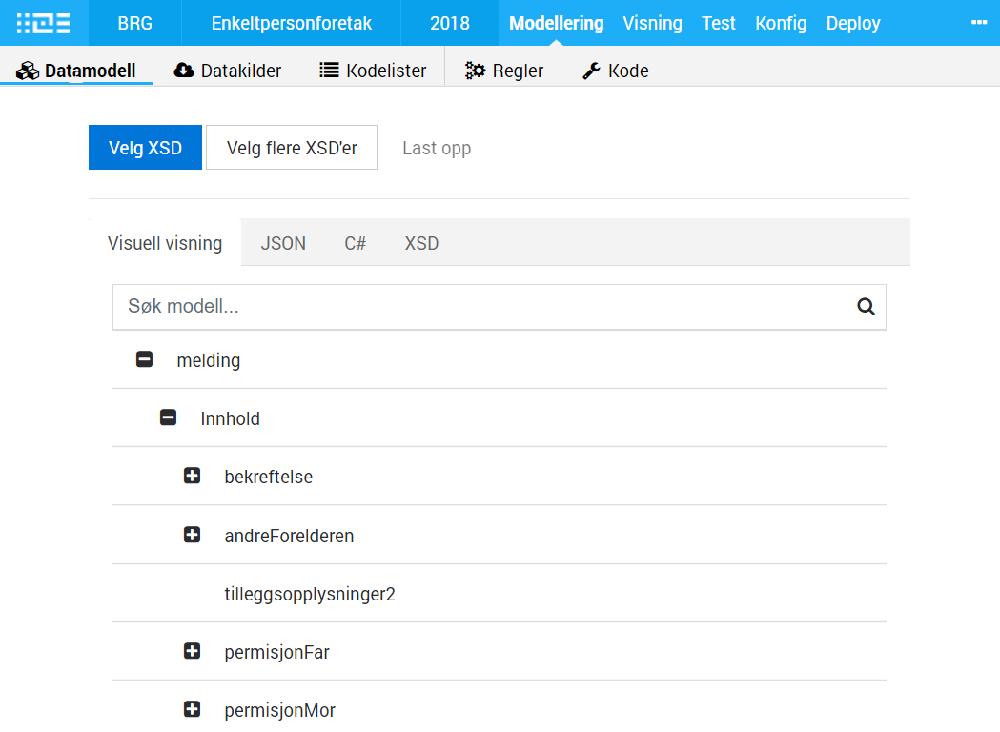

The data model for an app typical defines the format of the data either sent to the app owner or presented in the app
for the user. The data model is important for a consistent and formal definition of the data. It will
be used for validation both from UI and for external systems. 

Altinn Studio will support both importing existing data model as XSD or creating
a data modell. In MVP only import is in scope. 

Some requirements for Altinn Studio is:

- It should be easy to model data.
- Built in replacment for SERES (current tool).
- Need to support more formats. 

[See all issues related to Altinn Studio and data modeling on Github](https://github.com/Altinn/altinn-studio/labels/area%2Fdata-modeling).

