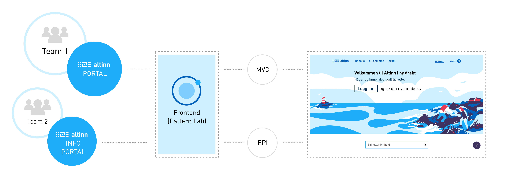

Siden vi er flere ulike team som jobber med ulike løsninger (men med samme brukergrensesnitt), trenger vi et felles sted for frontend. Dette er for å sikre at vi kun lager komponentene èn gang og at de fremtrer konsistent i brukergrensesnittet selv om de er implementert i ulike løsninger.

## Pattern Lab

For å bygge designsystemet har vi brukt «Pattern Lab», som er et verktøy for å lage atomiske designsystem. Pattern Lab fungerer som et arbeidsverktøy der frontend-utviklere lager alle UI-komponentene i HTML, CSS og Javasript. Komponentene kan settes sammen til sider, og deretter til en klikkbar prototype som kan brukertestes. Pattern Lab sørger for enkel prototyping og overlevering av CSS, javascript og HTML-kode til backend-utviklere.

<b>Pattern Lab brukes i hovedsak til to formål:</b>

- Pattern Lab skal være et hjem for alle UI-komponenter med deres styling og retningslinjer. CSS og javascript for komponentene skal **kun** eksistere og vedlikeholdes her.
- Pattern Lab skal fungere som prototypeverktøy. Alle maler skal i de fleste tilfeller prototypes og brukertestes før implementering.

{}
